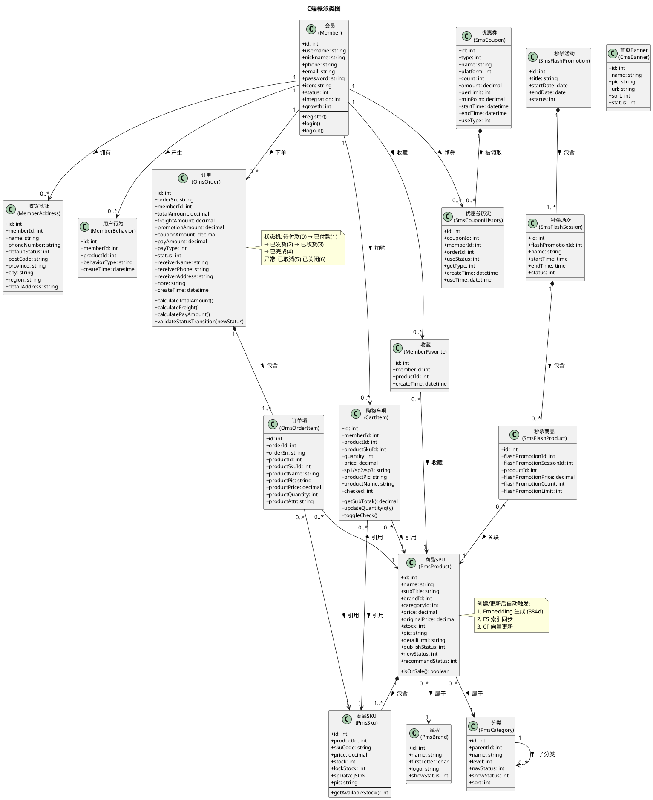
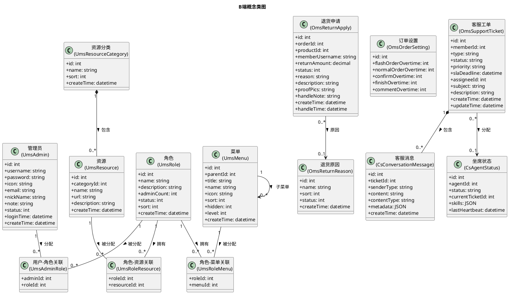
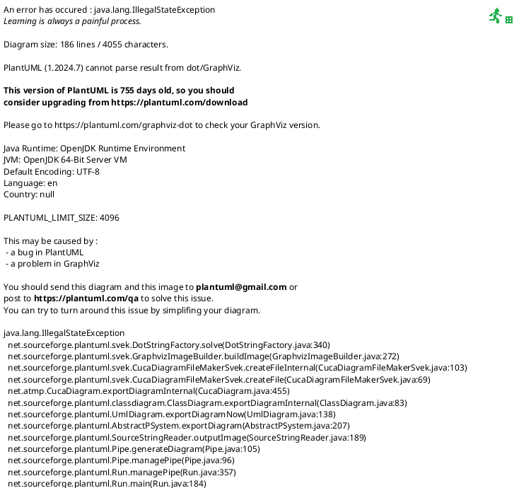
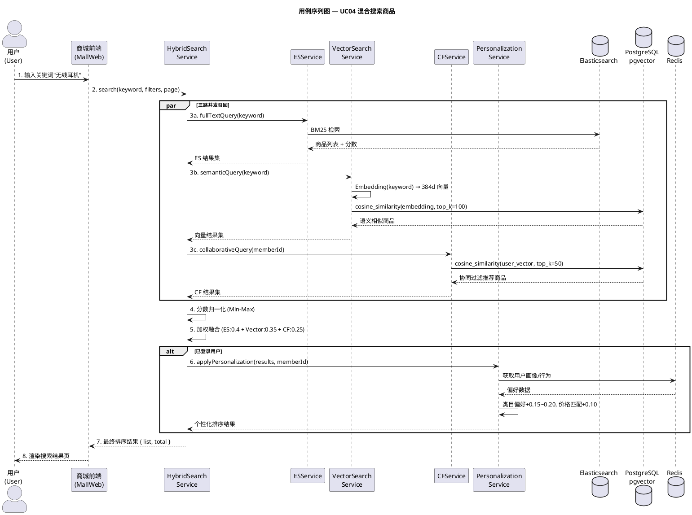
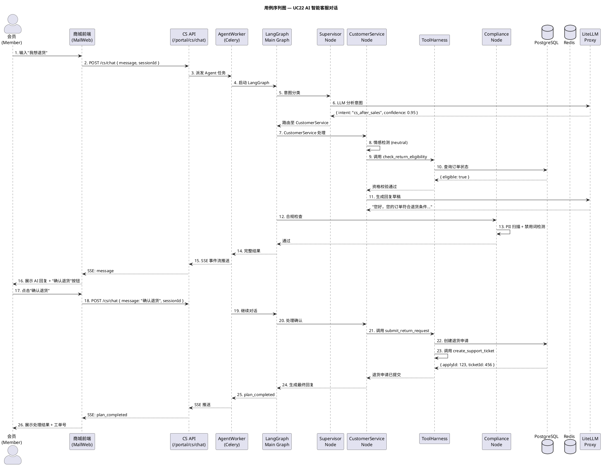
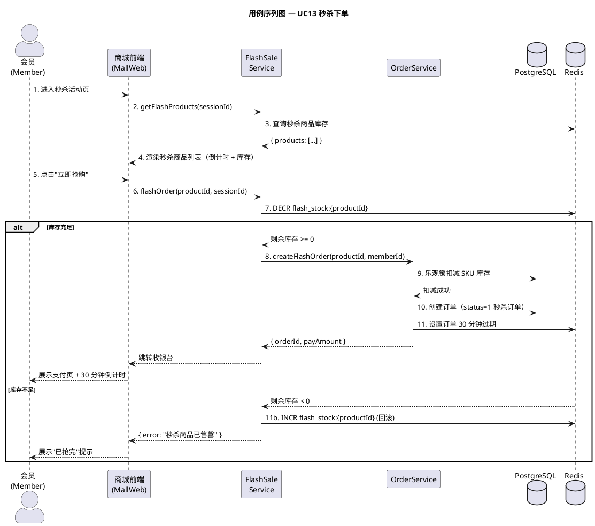
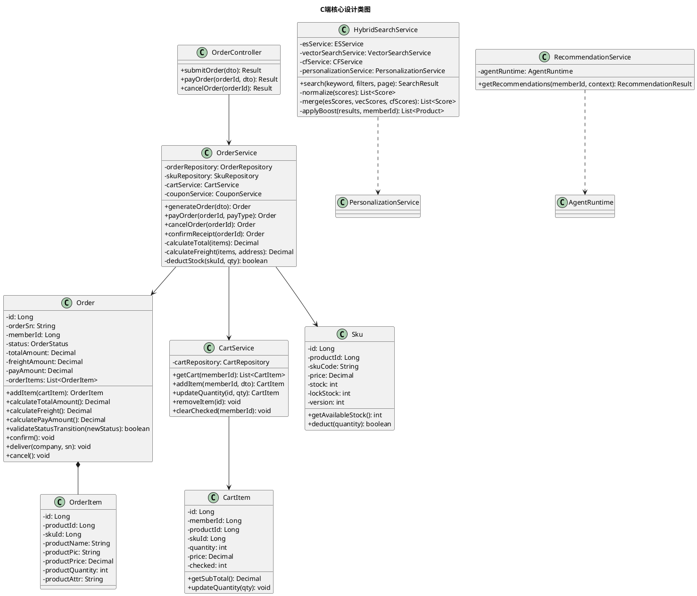
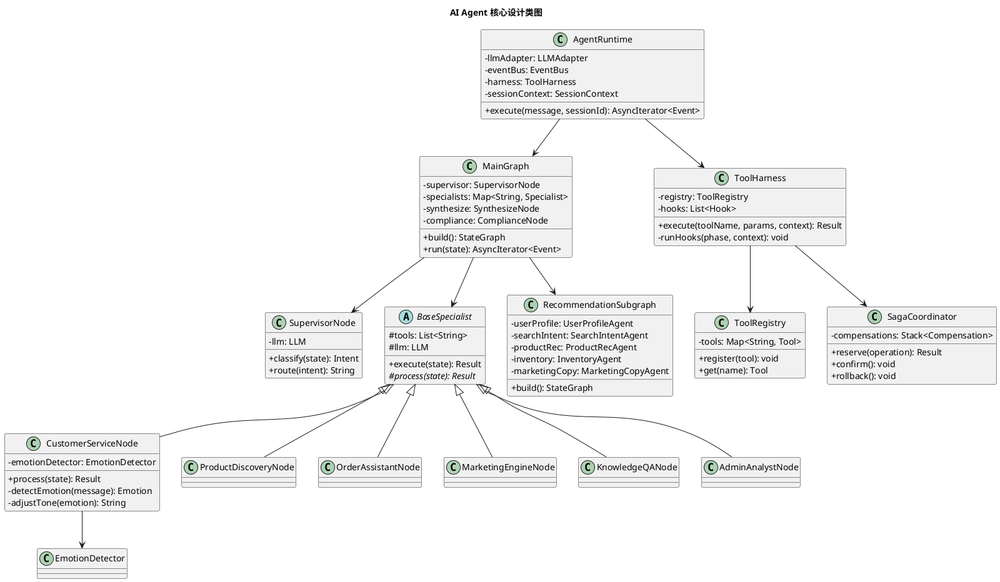
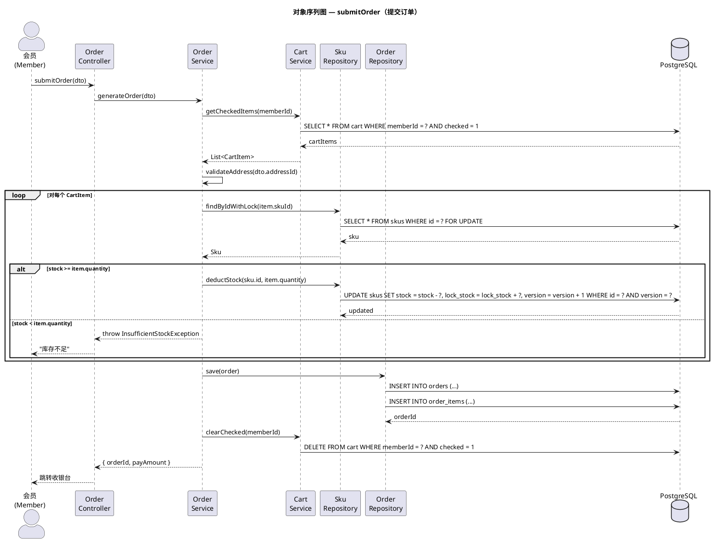
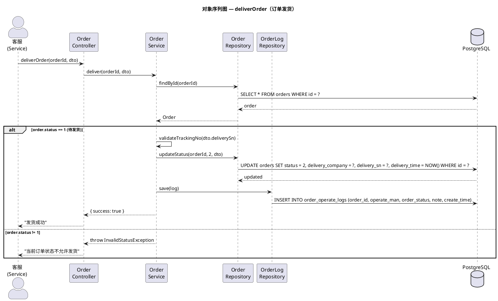

# 系统设计说明书（完善版）

> **版本**: V2.0  
> **日期**: 2026-06-21  
> **项目**: SnapTrip — AI 驱动的全栈电商平台  
> **编写说明**: 本文档基于项目实际技术架构（FastAPI + LangGraph + Vue 3 + PostgreSQL + Elasticsearch + Redis + Celery）编写，覆盖系统架构、数据库设计、API 设计、AI Agent 设计、关键用例详细设计等内容。

---

## 版本变更记录

| 版本 | 日期 | 修改人 | 修改内容 |
|------|------|--------|----------|
| V1.0 | 2026-06-XX | - | 初始版本：概念类图、2 个用例的序列图和操作契约、GRASP 模式分析 |
| V2.0 | 2026-06-21 | - | 新增：技术架构设计、数据库设计（ER图+物理表结构）、API 设计、AI Agent 系统设计、搜索推荐系统设计、更多关键用例设计（秒杀/AI客服/混合搜索）、非功能性设计、异常处理与容灾设计 |

---

## 一、系统架构设计

### 1.1 编写目的

本文档基于需求规格说明书，对 SnapTrip 电商平台进行详细设计。SnapTrip 是一个 AI 驱动的全栈电商平台，采用 FastAPI + LangGraph + Vue 3 技术栈，集成 AI 智能搜索、个性化推荐与多智能体客服。

### 1.2 产品架构

```
用户端 (C 端)                    管理端 (B 端)
  ├── 首页聚合 (5数据源并发)      ├── 商品管理 (PMS)
  ├── 混合搜索 (ES+向量+CF)       ├── 订单管理 (OMS)
  ├── 商品详情 / 品牌 / 分类      ├── 会员管理 (UMS)
  ├── 购物车 / 下单 / 支付        ├── 促销管理 (SMS)
  ├── 个人中心 / 收藏 / 地址      ├── 内容管理 (CMS)
  ├── 个性化推荐 (AI Agent)       ├── RBAC 权限
  └── 智能客服 (AI Agent)         └── AI 数据分析助手
```

### 1.3 技术架构分层

```
+---------------------------------------------------------------------------+
|                        PRESENTATION LAYER                                  |
|                                                                            |
|  +---------------------------+  +---------------------------------------+  |
|  | Admin Frontend (Vue 3)    |  | Customer Mall (Vue 3)                 |  |
|  | - Element Plus UI         |  | - Tailwind CSS UI                     |  |
|  | - Pinia State             |  | - Pinia State                         |  |
|  | - Vue Router (dynamic)    |  | - Vue Router                          |  |
|  +---------------------------+  +---------------------------------------+  |
+----------------------------------+-----------------------------------------+
                                   | REST / SSE
                                   v
+---------------------------------------------------------------------------+
|                         API GATEWAY LAYER                                  |
|                         FastAPI (port 8000)                                |
|                                                                            |
|  +---------------------------+  +---------------------------------------+  |
|  | Admin API (/admin/*)      |  | Portal API (/portal/*)                |  |
|  | - 18 个路由模块           |  | - 15 个路由模块                       |  |
|  +---------------------------+  +---------------------------------------+  |
|                                                                            |
|  Middleware: JWT Auth | Rate Limiter | Unified Response {code,msg,data}    |
+----------------------------------+-----------------------------------------+
                                   |
                                   v
+---------------------------------------------------------------------------+
|                          SERVICE LAYER                                     |
|                                                                            |
|  +---------------------+  +---------------------+  +--------------------+  |
|  | Commerce Services    |  | Search Services      |  | AI Services       |  |
|  | - product_service    |  | - hybrid_search      |  | - llm_gateway     |  |
|  | - order_service      |  | - vector_search      |  | - agent_graph     |  |
|  | - cart_service       |  | - autocomplete       |  | - recommendation  |  |
|  | - member_service     |  | - suggestion         |  |                   |  |
|  | - coupon_service     |  | - query_expansion    |  |                   |  |
|  | - flash_service      |  | - trending           |  |                   |  |
|  | - cms_service        |  | - personalization    |  |                   |  |
|  | - category_service   |  | - collaborative_f    |  |                   |  |
|  | - brand_service      |  | - feature_service    |  |                   |  |
|  | - stats_service      |  | - ab_test            |  |                   |  |
|  +---------------------+  +---------------------+  +--------------------+  |
+----------------------------------+-----------------------------------------+
                                   |
                                   v
+---------------------------------------------------------------------------+
|                          AI AGENT LAYER (LangGraph)                        |
|                                                                            |
|  Supervisor-Specialist Multi-Agent Architecture                            |
|                                                                            |
|  +----------+ +----------+ +----------+ +----------+ +----------+          |
|  | Product  | | Order    | | Marketing| | Knowledge| | Admin    |          |
|  | Discovery| | Assistant| | Engine   | | QA       | | Analyst  |          |
|  +----------+ +----------+ +----------+ +----------+ +----------+          |
|  |                            |                                            |
|  +----------+                 v                                            |
|  |Compliance|     Recommendation Subgraph                                  |
|  +----------+     +--------+ +--------+ +--------+ +--------+ +---------+  |
|                   |User    | |Search  | |Product | |Inventory| |Marketing|  |
|                   |Profile | |Intent  | |Rec     | |Check    | |Copy     |  |
|                   +--------+ +--------+ +--------+ +--------+ +---------+  |
|                                                                            |
|  Tool System: Registry | Saga Transactions | Audit Tracing (SHA-256)      |
+---------------------------------------------------------------------------+
                                   |
                                   v
+---------------------------------------------------------------------------+
|                          DATA LAYER                                        |
|                                                                            |
|  +---------------------+  +---------------------+  +--------------------+  |
|  | PostgreSQL 16       |  | Redis 7             |  | Elasticsearch 8    |  |
|  | + pgvector (384d)   |  | - Celery broker     |  | - Full-text search |  |
|  | - 40+ tables        |  | - Session cache     |  | - Product index    |  |
|  | - 6 domains         |  | - Rate limit        |  | - BM25 scoring     |  |
|  |                     |  | - SSE Pub/Sub       |  |                    |  |
|  +---------------------+  +---------------------+  +--------------------+  |
|                                                                            |
|  +--------------------+  +--------------------+                           |
|  | Celery Workers     |  | LiteLLM Proxy      |                           |
|  | - CF computation   |  | - LLM API gateway  |                           |
|  | - Search indexing  |  | - Multi-model      |                           |
|  | - Order processing |  |   routing          |                           |
|  | - Agent tasks      |  | - Cost tracking    |                           |
|  +--------------------+  +--------------------+                           |
+---------------------------------------------------------------------------+
```

### 1.4 部署架构（Docker Compose 8 服务）

```
                          docker compose up

+-------------------+  +-------------------+  +-------------------+
| marketplace :8000 |  | agent-worker      |  | agent-beat        |
|                   |  | (Celery Worker)   |  | (Celery Beat)     |
| FastAPI gateway   |  | LangGraph async   |  | Scheduled tasks   |
| + Celery Beat     |  | agent execution   |  | CF compute,       |
| Alembic migrations|  |                   |  | search indexing   |
+--------+----------+  +--------+----------+  +-------------------+
         |                      |
         v                      v
+--------+----------+  +--------+----------+  +-------------------+
| PostgreSQL 16     |  | Redis 7           |  | Elasticsearch 8   |
| pgvector          |  | broker/cache/     |  | product search    |
| :5432             |  | pubsub :6379      |  | :9200             |
+-------------------+  +-------------------+  +-------------------+
         |
         v
+--------+----------+  +-------------------+
| LiteLLM Proxy     |  | mall-web :5175    |
| LLM API gateway   |  | Customer SPA      |
| :4000             |  | (profile: full)   |
+-------------------+  +-------------------+
```

**服务清单**：

| 服务 | 镜像 | 端口 | 角色 |
|------|------|------|------|
| `postgres` | `pgvector/pgvector:pg16` | 5432 | 主数据库，含向量搜索扩展 |
| `redis` | `redis:7-alpine` | 6379 | 缓存、Celery Broker、SSE Pub/Sub |
| `elasticsearch` | `elasticsearch:8.15.3` | 9200 | 全文商品搜索引擎 |
| `litellm-proxy` | `ghcr.io/berriai/litellm` | 4000 | LLM API 网关（DeepSeek、Kimi 路由） |
| `marketplace` | Backend Dockerfile.gateway | 8000 | FastAPI 应用 + Celery Beat（启动自动迁移） |
| `agent-worker` | Backend Dockerfile.worker | -- | Celery Worker，执行 LangGraph Agent |
| `agent-beat` | Backend Dockerfile.worker | -- | Celery Beat，定时任务调度 |
| `mall-web` | mall-web/Dockerfile | 80/5175 | C 端购物网站 Vue 3 SPA |

### 1.5 技术栈选型

| 层级 | 技术 | 用途 | 版本/说明 |
|------|------|------|-----------|
| **后端框架** | Python 3.13 + FastAPI | REST API 网关 | 异步支持，自动 OpenAPI 文档 |
| **数据校验** | Pydantic v2 | 请求/响应 Schema | 类型安全，自动生成文档 |
| **ORM** | SQLAlchemy 2.0 async | 数据库操作 | 原生异步，支持 PostgreSQL |
| **迁移** | Alembic | 数据库版本管理 | SQLAlchemy 官方迁移工具 |
| **异步任务** | Celery + Redis | 后台任务队列 | CF 训练、索引同步、订单处理 |
| **数据库** | PostgreSQL 16 + pgvector | 关系数据 + 向量检索 | 384d 语义向量存储 |
| **搜索引擎** | Elasticsearch 8 | 全文检索 | BM25 评分，商品索引 |
| **缓存** | Redis 7 | Session / 限流 / PubSub | 多用途缓存层 |
| **AI Agent** | LangGraph | 多智能体编排 | StateGraph + Supervisor-Specialist |
| **LLM 网关** | LiteLLM Proxy | 统一 LLM API | 多模型路由、成本追踪、降级链 |
| **Embedding** | HuggingFace | 语义向量生成 | 本地模型，384 维 |
| **B 端前端** | Vue 3 + Vite + TypeScript + Element Plus | 管理后台 | Pinia 状态管理 |
| **C 端前端** | Vue 3 + Vite + TypeScript + Tailwind CSS | 购物网站 | 响应式布局 |
| **包管理** | uv workspace | Python Monorepo | 统一 lock 文件，共享库 |
| **部署** | Docker Compose | 多服务编排 | 8 服务一键启动 |
| **认证** | JWT + Refresh Token | 无状态认证 | Access 15min + Refresh 7天，轮换机制 |

### 1.6 关键架构决策

| 决策项 | 选型 | 理由 |
|--------|------|------|
| 后端模式 | 模块化单体 (Modular Monolith) | 避免分布式复杂度；目录清晰，未来可拆分为微服务 |
| Agent 框架 | LangGraph StateGraph | 原生状态持久化、中断/恢复支持人机协同、条件路由 |
| Agent 架构 | Supervisor-Specialist | 单一 Supervisor 路由至领域 Specialist；每个 Specialist 独立可测试 |
| LLM 网关 | LiteLLM Proxy | 统一多供应商 API（DeepSeek、Kimi）；成本追踪；模型降级 |
| 商品搜索 | Elasticsearch + pgvector 混合 | ES 负责关键词/文本匹配，pgvector 负责语义相似度；混合排序 |
| 商品 Embedding | HuggingFace 本地模型 (384d) | 离线推理，无 API 成本，维度一致 |
| 向量维度 | 384（非 1536） | 从 OpenAI text-embedding-3-small (1536d) 迁移至本地 HuggingFace 模型 (384d) |
| 协同过滤 | 自定义 CF 向量 + pgvector | 用户-商品交互矩阵存储为向量，用于相似度推荐 |
| 前端框架 | Vue 3 + Vite + TypeScript | 两个独立 SPA：Admin (Element Plus) 和 Mall (Tailwind CSS) |
| Monorepo 工具 | uv workspace | 快速依赖解析，统一 lock 文件，共享库 |
| 部署 | Docker Compose (8 服务) | 单机生产部署；水平扩展通过增加 worker 副本 |
| 认证 | JWT + Refresh Token 轮换 | 无状态 Access Token (15min) + SHA256 哈希 Refresh Token (7天) |
| Agent 工具系统 | ToolHarness 单例 + Hook 链 | 单一入口；Auth/RateLimit/Trace/Audit/Alert 可组合钩子 |
| 事务安全 | Saga (Reserve→Confirm→Rollback) + LIFO 补偿 | 多工具操作保持一致性；补偿注册表支持部分失败恢复 |
| 审计完整性 | SHA-256 哈希链 (AuditStore) | 每条记录通过加密哈希链接至前一条；verify_chain() 检测篡改 |
| 情感感知 | 关键词情感检测 | 5 类检测 + 多轮轨迹，注入 CustomerService 系统提示词调整语气 |
| 模型韧性 | 4 级降级链 + 指数退避重试 | DeepSeek V4 Pro → Flash → Kimi K2.6 → K2.5；每级 3 次重试 |
| 客服 | AI 优先 + 人工升级路径 | AI 通过 20 个工具处理常见问题；SLA 违约触发客服通知；基于工单交接 |

---

## 二、概念类图

### 2.1 C 端 — 购物客户端（web）



### 2.2 B 端 — 管理系统



---

## 三、数据库设计

### 3.1 ER 关系图（核心实体）



### 3.2 物理表结构设计

#### 3.2.1 商品域 (PMS)

```sql
-- 商品 SPU 主表
CREATE TABLE pms_products (
    id BIGSERIAL PRIMARY KEY,
    name VARCHAR(255) NOT NULL,
    sub_title VARCHAR(255),
    brand_id BIGINT NOT NULL REFERENCES pms_brands(id),
    category_id BIGINT NOT NULL REFERENCES pms_categories(id),
    price DECIMAL(10,2) NOT NULL DEFAULT 0,
    original_price DECIMAL(10,2),
    stock INT NOT NULL DEFAULT 0,
    pic VARCHAR(255),
    album_pics TEXT,
    detail_html TEXT,
    publish_status INT NOT NULL DEFAULT 0,  -- 0未上架 1已上架
    new_status INT NOT NULL DEFAULT 0,      -- 0非新品 1新品
    recommand_status INT NOT NULL DEFAULT 0, -- 0不推荐 1推荐
    verify_status INT NOT NULL DEFAULT 0,   -- 0待审核 1通过 2驳回
    sale INT DEFAULT 0,
    unit VARCHAR(16),
    weight DECIMAL(10,2),
    keywords VARCHAR(255),
    note VARCHAR(255),
    detail_title VARCHAR(255),
    detail_desc TEXT,
    create_time TIMESTAMP DEFAULT CURRENT_TIMESTAMP,
    update_time TIMESTAMP DEFAULT CURRENT_TIMESTAMP,
    
    INDEX idx_brand_id (brand_id),
    INDEX idx_category_id (category_id),
    INDEX idx_publish_status (publish_status),
    INDEX idx_new_status (new_status),
    INDEX idx_recommand_status (recommand_status),
    INDEX idx_verify_status (verify_status),
    INDEX idx_price (price),
    INDEX idx_create_time (create_time)
);

-- 商品 SKU 表
CREATE TABLE pms_skus (
    id BIGSERIAL PRIMARY KEY,
    product_id BIGINT NOT NULL REFERENCES pms_products(id) ON DELETE CASCADE,
    sku_code VARCHAR(64) NOT NULL,
    price DECIMAL(10,2) NOT NULL DEFAULT 0,
    stock INT NOT NULL DEFAULT 0,
    lock_stock INT NOT NULL DEFAULT 0,  -- 锁定库存（订单未支付）
    pic VARCHAR(255),
    sp_data JSONB,  -- SKU 规格 JSON {"颜色": "黑色", "内存": "256GB"}
    sale INT DEFAULT 0,
    create_time TIMESTAMP DEFAULT CURRENT_TIMESTAMP,
    update_time TIMESTAMP DEFAULT CURRENT_TIMESTAMP,
    
    UNIQUE (product_id, sku_code),
    INDEX idx_product_id (product_id)
);

-- 品牌表
CREATE TABLE pms_brands (
    id BIGSERIAL PRIMARY KEY,
    name VARCHAR(64) NOT NULL UNIQUE,
    first_letter CHAR(1),
    logo VARCHAR(255),
    factory_status INT DEFAULT 0,
    show_status INT DEFAULT 1,
    product_count INT DEFAULT 0,
    product_comment_count INT DEFAULT 0,
    sort INT DEFAULT 0,
    create_time TIMESTAMP DEFAULT CURRENT_TIMESTAMP
);

-- 分类树表
CREATE TABLE pms_categories (
    id BIGSERIAL PRIMARY KEY,
    parent_id BIGINT DEFAULT 0 REFERENCES pms_categories(id),
    name VARCHAR(64) NOT NULL,
    level INT NOT NULL DEFAULT 1,  -- 1/2/3 级
    product_count INT DEFAULT 0,
    product_unit VARCHAR(50),
    nav_status INT DEFAULT 0,     -- 0不显示 1导航栏显示
    show_status INT DEFAULT 1,    -- 0隐藏 1显示
    sort INT DEFAULT 0,
    icon VARCHAR(255),
    keywords VARCHAR(255),
    description TEXT,
    create_time TIMESTAMP DEFAULT CURRENT_TIMESTAMP,
    
    INDEX idx_parent_id (parent_id),
    INDEX idx_level (level),
    INDEX idx_show_status (show_status)
);

-- 商品属性定义 (EAV)
CREATE TABLE pms_product_attributes (
    id BIGSERIAL PRIMARY KEY,
    product_attribute_category_id BIGINT NOT NULL,
    name VARCHAR(64) NOT NULL,
    select_type INT DEFAULT 0,    -- 0唯一 1单选 2多选
    input_type INT DEFAULT 0,     -- 0手工录入 1从列表选取
    input_list VARCHAR(255),      -- 可选值列表，逗号分隔
    sort INT DEFAULT 0,
    filter_type INT DEFAULT 0,    -- 0普通 1颜色
    search_type INT DEFAULT 0,    -- 0不需要 1关键字 2范围
    related_status INT DEFAULT 0,
    hand_add_status INT DEFAULT 0,
    type INT NOT NULL DEFAULT 0   -- 0规格 1参数
);

-- 属性值关联
CREATE TABLE pms_product_attribute_values (
    id BIGSERIAL PRIMARY KEY,
    product_id BIGINT NOT NULL REFERENCES pms_products(id) ON DELETE CASCADE,
    product_attribute_id BIGINT NOT NULL REFERENCES pms_product_attributes(id),
    value VARCHAR(64) NOT NULL,
    
    INDEX idx_product_id (product_id),
    INDEX idx_attribute_id (product_attribute_id)
);

-- 语义向量表 (384d)
CREATE TABLE pms_product_embeddings (
    id BIGSERIAL PRIMARY KEY,
    product_id BIGINT NOT NULL UNIQUE REFERENCES pms_products(id) ON DELETE CASCADE,
    embedding VECTOR(384) NOT NULL,
    create_time TIMESTAMP DEFAULT CURRENT_TIMESTAMP,
    update_time TIMESTAMP DEFAULT CURRENT_TIMESTAMP,
    
    INDEX idx_embedding USING ivfflat (embedding vector_cosine_ops)
);

-- 协同过滤向量表 (64d)
CREATE TABLE pms_product_cf_vectors (
    id BIGSERIAL PRIMARY KEY,
    product_id BIGINT NOT NULL UNIQUE REFERENCES pms_products(id) ON DELETE CASCADE,
    cf_vector VECTOR(64) NOT NULL,
    create_time TIMESTAMP DEFAULT CURRENT_TIMESTAMP,
    update_time TIMESTAMP DEFAULT CURRENT_TIMESTAMP,
    
    INDEX idx_cf_vector USING ivfflat (cf_vector vector_cosine_ops)
);
```

#### 3.2.2 订单域 (OMS)

```sql
-- 订单主表
CREATE TABLE oms_orders (
    id BIGSERIAL PRIMARY KEY,
    order_sn VARCHAR(64) NOT NULL UNIQUE,
    member_id BIGINT NOT NULL,
    member_username VARCHAR(64),
    total_amount DECIMAL(10,2) NOT NULL DEFAULT 0,      -- 商品总金额
    freight_amount DECIMAL(10,2) DEFAULT 0,             -- 运费
    promotion_amount DECIMAL(10,2) DEFAULT 0,           -- 促销优惠
    integration_amount DECIMAL(10,2) DEFAULT 0,         -- 积分抵扣
    coupon_amount DECIMAL(10,2) DEFAULT 0,              -- 优惠券抵扣
    discount_amount DECIMAL(10,2) DEFAULT 0,            -- 折扣金额
    pay_amount DECIMAL(10,2) NOT NULL DEFAULT 0,        -- 应付金额
    pay_type INT DEFAULT 0,      -- 0未支付 1支付宝 2微信 3银行卡
    source_type INT DEFAULT 0,   -- 0PC订单 1APP订单
    status INT NOT NULL DEFAULT 0,  -- 0待付款 1已付款 2已发货 3已收货 4已完成 5已取消 6已关闭 7退货中
    order_type INT DEFAULT 0,    -- 0正常订单 1秒杀订单 2团购订单
    delivery_company VARCHAR(64),
    delivery_sn VARCHAR(64),
    auto_confirm_day INT DEFAULT 15,
    receiver_name VARCHAR(100) NOT NULL,
    receiver_phone VARCHAR(32) NOT NULL,
    receiver_post_code VARCHAR(32),
    receiver_province VARCHAR(64),
    receiver_city VARCHAR(64),
    receiver_region VARCHAR(64),
    receiver_detail_address VARCHAR(200) NOT NULL,
    note VARCHAR(500),
    confirm_status INT DEFAULT 0,  -- 0未确认 1已确认
    delete_status INT DEFAULT 0,   -- 0未删除 1已删除
    payment_time TIMESTAMP,
    delivery_time TIMESTAMP,
    receive_time TIMESTAMP,
    comment_time TIMESTAMP,
    create_time TIMESTAMP DEFAULT CURRENT_TIMESTAMP,
    modify_time TIMESTAMP DEFAULT CURRENT_TIMESTAMP,
    
    INDEX idx_member_id (member_id),
    INDEX idx_order_sn (order_sn),
    INDEX idx_status (status),
    INDEX idx_create_time (create_time),
    INDEX idx_pay_type (pay_type)
);

-- 订单明细表
CREATE TABLE oms_order_items (
    id BIGSERIAL PRIMARY KEY,
    order_id BIGINT NOT NULL REFERENCES oms_orders(id) ON DELETE CASCADE,
    order_sn VARCHAR(64),
    product_id BIGINT NOT NULL,
    product_pic VARCHAR(500),
    product_name VARCHAR(255),
    product_brand VARCHAR(255),
    product_sn VARCHAR(64),
    product_price DECIMAL(10,2) NOT NULL,
    product_quantity INT NOT NULL,
    product_sku_id BIGINT,
    product_sku_code VARCHAR(64),
    product_category_id BIGINT,
    promotion_name VARCHAR(255),
    promotion_amount DECIMAL(10,2),
    coupon_amount DECIMAL(10,2),
    integration_amount DECIMAL(10,2),
    real_amount DECIMAL(10,2),
    gift_integration INT DEFAULT 0,
    gift_growth INT DEFAULT 0,
    product_attr VARCHAR(255),
    
    INDEX idx_order_id (order_id),
    INDEX idx_product_id (product_id)
);

-- 购物车表
CREATE TABLE oms_cart_items (
    id BIGSERIAL PRIMARY KEY,
    product_id BIGINT NOT NULL,
    product_sku_id BIGINT,
    member_id BIGINT NOT NULL,
    quantity INT NOT NULL DEFAULT 1,
    price DECIMAL(10,2),
    sp1 VARCHAR(64),  -- 规格1
    sp2 VARCHAR(64),  -- 规格2
    sp3 VARCHAR(64),  -- 规格3
    product_pic VARCHAR(1000),
    product_name VARCHAR(500),
    product_sub_title VARCHAR(500),
    product_sku_code VARCHAR(200),
    delete_status INT DEFAULT 0,   -- 0未删除 1已删除
    product_category_id BIGINT,
    product_brand VARCHAR(200),
    product_sn VARCHAR(200),
    create_date TIMESTAMP DEFAULT CURRENT_TIMESTAMP,
    modify_date TIMESTAMP DEFAULT CURRENT_TIMESTAMP,
    
    UNIQUE (member_id, product_id, product_sku_id, delete_status),
    INDEX idx_member_id (member_id),
    INDEX idx_product_id (product_id)
);

-- 退货申请表
CREATE TABLE oms_return_applies (
    id BIGSERIAL PRIMARY KEY,
    order_id BIGINT NOT NULL,
    company_address_id BIGINT,
    product_id BIGINT,
    order_sn VARCHAR(64),
    create_time TIMESTAMP DEFAULT CURRENT_TIMESTAMP,
    member_username VARCHAR(64),
    return_amount DECIMAL(10,2),
    return_name VARCHAR(100),
    return_phone VARCHAR(20),
    status INT DEFAULT 0,  -- 0待处理 1待退货入库 2已拒绝 3已完成
    handle_time TIMESTAMP,
    product_pic VARCHAR(500),
    product_name VARCHAR(200),
    product_brand VARCHAR(200),
    product_attr VARCHAR(200),
    product_count INT,
    product_price DECIMAL(10,2),
    product_real_price DECIMAL(10,2),
    reason VARCHAR(200),
    description VARCHAR(1000),
    proof_pics VARCHAR(1000),
    handle_note VARCHAR(500),
    handle_man VARCHAR(100),
    receive_man VARCHAR(100),
    receive_time TIMESTAMP,
    receive_note VARCHAR(500),
    
    INDEX idx_order_id (order_id),
    INDEX idx_status (status),
    INDEX idx_member_username (member_username)
);

-- 退货原因表
CREATE TABLE oms_return_reasons (
    id BIGSERIAL PRIMARY KEY,
    name VARCHAR(255) NOT NULL,
    sort INT DEFAULT 0,
    status INT DEFAULT 1,  -- 0停用 1启用
    create_time TIMESTAMP DEFAULT CURRENT_TIMESTAMP
);

-- 订单设置表
CREATE TABLE oms_order_settings (
    id BIGSERIAL PRIMARY KEY,
    flash_order_overtime INT DEFAULT 30,      -- 秒杀订单超时(分钟)
    normal_order_overtime INT DEFAULT 60,     -- 普通订单超时(分钟)
    confirm_overtime INT DEFAULT 15,          -- 自动确认收货(天)
    finish_overtime INT DEFAULT 7,            -- 自动完成(天)
    comment_overtime INT DEFAULT 15           -- 自动评价(天)
);

-- 客服工单表
CREATE TABLE oms_support_tickets (
    id BIGSERIAL PRIMARY KEY,
    member_id BIGINT NOT NULL,
    type VARCHAR(50) NOT NULL,         -- return/refund/complaint/inquiry
    status VARCHAR(50) NOT NULL DEFAULT 'open',  -- open/pending/resolved/closed
    priority VARCHAR(20) DEFAULT 'normal',       -- critical/urgent/normal/low
    sla_deadline TIMESTAMP,
    assignee_id BIGINT,                -- 分配的客服
    subject VARCHAR(255) NOT NULL,
    description TEXT,
    source VARCHAR(50) DEFAULT 'ai_agent',  -- ai_agent/manual
    create_time TIMESTAMP DEFAULT CURRENT_TIMESTAMP,
    update_time TIMESTAMP DEFAULT CURRENT_TIMESTAMP,
    resolve_time TIMESTAMP,
    
    INDEX idx_member_id (member_id),
    INDEX idx_status (status),
    INDEX idx_priority (priority),
    INDEX idx_assignee (assignee_id),
    INDEX idx_sla_deadline (sla_deadline)
);

-- 客服消息表
CREATE TABLE cs_conversation_messages (
    id BIGSERIAL PRIMARY KEY,
    ticket_id BIGINT REFERENCES oms_support_tickets(id) ON DELETE CASCADE,
    sender_type VARCHAR(20) NOT NULL,   -- customer/agent/ai_system
    content TEXT NOT NULL,
    content_type VARCHAR(20) DEFAULT 'text',  -- text/image/card/action
    metadata JSONB,                     -- 额外信息如情感分数、工具调用等
    create_time TIMESTAMP DEFAULT CURRENT_TIMESTAMP,
    
    INDEX idx_ticket_id (ticket_id),
    INDEX idx_create_time (create_time)
);
```

#### 3.2.3 会员域 (UMS)

```sql
-- 会员表
CREATE TABLE ums_members (
    id BIGSERIAL PRIMARY KEY,
    username VARCHAR(64) NOT NULL UNIQUE,
    password VARCHAR(128) NOT NULL,  -- BCrypt 加密
    nickname VARCHAR(64),
    phone VARCHAR(20) UNIQUE,
    email VARCHAR(100) UNIQUE,
    status INT DEFAULT 1,       -- 0禁用 1启用
    icon VARCHAR(500),
    gender INT,                 -- 0未知 1男 2女
    birthday DATE,
    city VARCHAR(64),
    job VARCHAR(64),
    personalized_signature VARCHAR(200),
    source_type INT DEFAULT 0,  -- 0PC注册 1APP注册
    integration INT DEFAULT 0,
    growth INT DEFAULT 0,
    luckey_count INT DEFAULT 0,
    history_integration INT DEFAULT 0,
    create_time TIMESTAMP DEFAULT CURRENT_TIMESTAMP,
    
    INDEX idx_username (username),
    INDEX idx_phone (phone),
    INDEX idx_status (status)
);

-- 收货地址表
CREATE TABLE ums_member_addresses (
    id BIGSERIAL PRIMARY KEY,
    member_id BIGINT NOT NULL REFERENCES ums_members(id) ON DELETE CASCADE,
    name VARCHAR(64) NOT NULL,
    phone_number VARCHAR(20) NOT NULL,
    default_status INT DEFAULT 0,  -- 0非默认 1默认
    post_code VARCHAR(32),
    province VARCHAR(64) NOT NULL,
    city VARCHAR(64) NOT NULL,
    region VARCHAR(64) NOT NULL,
    detail_address VARCHAR(200) NOT NULL,
    
    INDEX idx_member_id (member_id)
);

-- 收藏表
CREATE TABLE ums_member_favorites (
    id BIGSERIAL PRIMARY KEY,
    member_id BIGINT NOT NULL,
    product_id BIGINT NOT NULL,
    product_name VARCHAR(255),
    product_pic VARCHAR(500),
    product_price DECIMAL(10,2),
    product_sub_title VARCHAR(255),
    create_time TIMESTAMP DEFAULT CURRENT_TIMESTAMP,
    
    UNIQUE (member_id, product_id),
    INDEX idx_member_id (member_id),
    INDEX idx_product_id (product_id)
);

-- 用户行为埋点表
CREATE TABLE ums_member_behaviors (
    id BIGSERIAL PRIMARY KEY,
    member_id BIGINT NOT NULL,
    product_id BIGINT,
    behavior_type VARCHAR(20) NOT NULL,  -- view/search/add_cart/purchase/favorite
    search_keyword VARCHAR(255),
    metadata JSONB,
    create_time TIMESTAMP DEFAULT CURRENT_TIMESTAMP,
    
    INDEX idx_member_id (member_id),
    INDEX idx_product_id (product_id),
    INDEX idx_behavior_type (behavior_type),
    INDEX idx_create_time (create_time)
);

-- 搜索日志表
CREATE TABLE ums_member_search_logs (
    id BIGSERIAL PRIMARY KEY,
    member_id BIGINT,
    keyword VARCHAR(255) NOT NULL,
    filters JSONB,
    result_count INT DEFAULT 0,
    create_time TIMESTAMP DEFAULT CURRENT_TIMESTAMP,
    
    INDEX idx_member_id (member_id),
    INDEX idx_keyword (keyword),
    INDEX idx_create_time (create_time)
);

-- 后台管理员表
CREATE TABLE ums_admins (
    id BIGSERIAL PRIMARY KEY,
    username VARCHAR(64) NOT NULL UNIQUE,
    password VARCHAR(128) NOT NULL,
    icon VARCHAR(500),
    email VARCHAR(100),
    nick_name VARCHAR(64),
    note VARCHAR(255),
    create_time TIMESTAMP DEFAULT CURRENT_TIMESTAMP,
    login_time TIMESTAMP,
    status INT DEFAULT 1,  -- 0禁用 1启用
    
    INDEX idx_username (username),
    INDEX idx_status (status)
);

-- 角色表
CREATE TABLE ums_roles (
    id BIGSERIAL PRIMARY KEY,
    name VARCHAR(64) NOT NULL UNIQUE,
    description VARCHAR(255),
    admin_count INT DEFAULT 0,
    status INT DEFAULT 1,  -- 0停用 1启用
    sort INT DEFAULT 0,
    create_time TIMESTAMP DEFAULT CURRENT_TIMESTAMP
);

-- 菜单表
CREATE TABLE ums_menus (
    id BIGSERIAL PRIMARY KEY,
    parent_id BIGINT DEFAULT 0,
    title VARCHAR(64) NOT NULL,
    name VARCHAR(64),
    icon VARCHAR(128),
    sort INT DEFAULT 0,
    hidden INT DEFAULT 0,   -- 0显示 1隐藏
    level INT DEFAULT 1,    -- 1/2/3 级
    create_time TIMESTAMP DEFAULT CURRENT_TIMESTAMP,
    
    INDEX idx_parent_id (parent_id)
);

-- 资源表
CREATE TABLE ums_resources (
    id BIGSERIAL PRIMARY KEY,
    category_id BIGINT NOT NULL,
    name VARCHAR(64) NOT NULL,
    url VARCHAR(200) NOT NULL,
    description VARCHAR(255),
    create_time TIMESTAMP DEFAULT CURRENT_TIMESTAMP,
    
    INDEX idx_category_id (category_id)
);

-- 资源分类表
CREATE TABLE ums_resource_categories (
    id BIGSERIAL PRIMARY KEY,
    name VARCHAR(64) NOT NULL,
    sort INT DEFAULT 0,
    create_time TIMESTAMP DEFAULT CURRENT_TIMESTAMP
);

-- 角色-菜单关联
CREATE TABLE ums_role_menus (
    role_id BIGINT NOT NULL REFERENCES ums_roles(id) ON DELETE CASCADE,
    menu_id BIGINT NOT NULL REFERENCES ums_menus(id) ON DELETE CASCADE,
    PRIMARY KEY (role_id, menu_id)
);

-- 角色-资源关联
CREATE TABLE ums_role_resources (
    role_id BIGINT NOT NULL REFERENCES ums_roles(id) ON DELETE CASCADE,
    resource_id BIGINT NOT NULL REFERENCES ums_resources(id) ON DELETE CASCADE,
    PRIMARY KEY (role_id, resource_id)
);

-- 管理员-角色关联
CREATE TABLE ums_admin_roles (
    admin_id BIGINT NOT NULL REFERENCES ums_admins(id) ON DELETE CASCADE,
    role_id BIGINT NOT NULL REFERENCES ums_roles(id) ON DELETE CASCADE,
    PRIMARY KEY (admin_id, role_id)
);
```

#### 3.2.4 促销域 (SMS)

```sql
-- 优惠券模板表
CREATE TABLE sms_coupons (
    id BIGSERIAL PRIMARY KEY,
    type INT NOT NULL,           -- 0全场赠券 1会员赠券 2购物赠券 3注册赠券
    name VARCHAR(100) NOT NULL,
    platform INT DEFAULT 0,      -- 0全平台 1PC 2APP
    count INT NOT NULL,          -- 发行数量
    amount DECIMAL(10,2) NOT NULL,  -- 面额
    per_limit INT DEFAULT 1,     -- 每人限领张数
    min_point DECIMAL(10,2),     -- 使用门槛
    start_time TIMESTAMP NOT NULL,
    end_time TIMESTAMP NOT NULL,
    use_type INT DEFAULT 0,      -- 0全场通用 1指定分类 2指定商品
    note VARCHAR(255),
    publish_count INT DEFAULT 0, -- 发行数量
    use_count INT DEFAULT 0,     -- 已使用数量
    receive_count INT DEFAULT 0, -- 已领取数量
    enable_time TIMESTAMP,       -- 可以领取的日期
    code VARCHAR(64),            -- 优惠券码
    member_level INT DEFAULT 0,  -- 可领取的会员类型
    create_time TIMESTAMP DEFAULT CURRENT_TIMESTAMP,
    
    INDEX idx_type (type),
    INDEX idx_status (status),
    INDEX idx_start_time (start_time),
    INDEX idx_end_time (end_time)
);

-- 优惠券使用记录表
CREATE TABLE sms_coupon_histories (
    id BIGSERIAL PRIMARY KEY,
    coupon_id BIGINT NOT NULL REFERENCES sms_coupons(id),
    member_id BIGINT NOT NULL,
    order_id BIGINT,
    coupon_code VARCHAR(64),
    member_nickname VARCHAR(64),
    get_type INT DEFAULT 0,      -- 0后台赠送 1主动获取
    create_time TIMESTAMP DEFAULT CURRENT_TIMESTAMP,
    use_status INT DEFAULT 0,    -- 0未使用 1已使用 2已过期
    use_time TIMESTAMP,
    order_sn VARCHAR(64),
    version INT DEFAULT 0,       -- 乐观锁版本号
    
    INDEX idx_coupon_id (coupon_id),
    INDEX idx_member_id (member_id),
    INDEX idx_use_status (use_status)
);

-- 秒杀活动表
CREATE TABLE sms_flash_promotions (
    id BIGSERIAL PRIMARY KEY,
    title VARCHAR(200) NOT NULL,
    start_date DATE NOT NULL,
    end_date DATE NOT NULL,
    status INT DEFAULT 0,  -- 0未开始 1进行中 2已结束
    create_time TIMESTAMP DEFAULT CURRENT_TIMESTAMP,
    
    INDEX idx_status (status),
    INDEX idx_date_range (start_date, end_date)
);

-- 秒杀场次表
CREATE TABLE sms_flash_sessions (
    id BIGSERIAL PRIMARY KEY,
    flash_promotion_id BIGINT NOT NULL REFERENCES sms_flash_promotions(id) ON DELETE CASCADE,
    name VARCHAR(64) NOT NULL,     -- 如 "10:00场"
    start_time TIME NOT NULL,
    end_time TIME NOT NULL,
    status INT DEFAULT 0,
    create_time TIMESTAMP DEFAULT CURRENT_TIMESTAMP,
    
    INDEX idx_flash_promotion_id (flash_promotion_id)
);

-- 秒杀商品关联表
CREATE TABLE sms_flash_promotion_products (
    id BIGSERIAL PRIMARY KEY,
    flash_promotion_id BIGINT NOT NULL REFERENCES sms_flash_promotions(id) ON DELETE CASCADE,
    flash_promotion_session_id BIGINT NOT NULL REFERENCES sms_flash_sessions(id) ON DELETE CASCADE,
    product_id BIGINT NOT NULL,
    flash_promotion_price DECIMAL(10,2) NOT NULL,
    flash_promotion_count INT NOT NULL,   -- 秒杀库存
    flash_promotion_limit INT DEFAULT 1,  -- 每人限购
    sort INT DEFAULT 0,
    
    INDEX idx_flash_promotion_id (flash_promotion_id),
    INDEX idx_session_id (flash_promotion_session_id),
    INDEX idx_product_id (product_id)
);
```

#### 3.2.5 内容域 (CMS) 与基础设施

```sql
-- Banner 表
CREATE TABLE cms_banners (
    id BIGSERIAL PRIMARY KEY,
    name VARCHAR(64) NOT NULL,
    pic VARCHAR(500) NOT NULL,
    url VARCHAR(500),
    sort INT DEFAULT 0,
    status INT DEFAULT 1,      -- 0下线 1上线
    position INT DEFAULT 0,    -- 0PC 1APP
    start_time TIMESTAMP,
    end_time TIMESTAMP,
    create_time TIMESTAMP DEFAULT CURRENT_TIMESTAMP
);

-- 专题表
CREATE TABLE cms_subjects (
    id BIGSERIAL PRIMARY KEY,
    category_id BIGINT,
    title VARCHAR(255) NOT NULL,
    pic VARCHAR(500),
    product_count INT DEFAULT 0,
    read_count INT DEFAULT 0,
    collect_count INT DEFAULT 0,
    comment_count INT DEFAULT 0,
    recommend_status INT DEFAULT 0,
    show_status INT DEFAULT 1,
    content TEXT,
    create_time TIMESTAMP DEFAULT CURRENT_TIMESTAMP
);

-- 帮助中心表
CREATE TABLE cms_helps (
    id BIGSERIAL PRIMARY KEY,
    category_id BIGINT,
    title VARCHAR(255) NOT NULL,
    content TEXT,
    show_status INT DEFAULT 1,
    read_count INT DEFAULT 0,
    create_time TIMESTAMP DEFAULT CURRENT_TIMESTAMP
);

-- 客服通知表
CREATE TABLE cs_notifications (
    id BIGSERIAL PRIMARY KEY,
    admin_id BIGINT NOT NULL,       -- 接收通知的管理员
    type VARCHAR(50) NOT NULL,      -- sla_breach/ticket_assigned/system
    title VARCHAR(255) NOT NULL,
    content TEXT,
    is_read INT DEFAULT 0,          -- 0未读 1已读
    source_id BIGINT,               -- 关联的工单ID等
    create_time TIMESTAMP DEFAULT CURRENT_TIMESTAMP,
    
    INDEX idx_admin_id (admin_id),
    INDEX idx_is_read (is_read),
    INDEX idx_type (type)
);

-- 坐席状态表
CREATE TABLE cs_agent_status (
    id BIGSERIAL PRIMARY KEY,
    agent_id BIGINT NOT NULL UNIQUE REFERENCES ums_admins(id),
    status VARCHAR(20) DEFAULT 'offline',  -- online/offline/busy
    current_ticket_id BIGINT,
    skills JSONB,                          -- 技能标签 ["return", "refund", "complaint"]
    max_concurrent_tickets INT DEFAULT 5,
    resolved_today INT DEFAULT 0,
    last_heartbeat TIMESTAMP,
    update_time TIMESTAMP DEFAULT CURRENT_TIMESTAMP,
    
    INDEX idx_status (status)
);

-- 会话摘要表
CREATE TABLE cs_session_summaries (
    id BIGSERIAL PRIMARY KEY,
    ticket_id BIGINT NOT NULL REFERENCES oms_support_tickets(id),
    member_id BIGINT NOT NULL,
    intent VARCHAR(50),                    -- 主要意图
    emotion_trajectory JSONB,              -- 情感轨迹 [{"turn": 1, "emotion": "angry"}]
    tools_used JSONB,                      -- 工具调用列表
    resolution VARCHAR(50),                -- resolved/escalated/unresolved
    summary TEXT,                          -- 会话摘要文本
    satisfaction_estimate INT,             -- 预估满意度 1-5
    create_time TIMESTAMP DEFAULT CURRENT_TIMESTAMP,
    
    INDEX idx_ticket_id (ticket_id),
    INDEX idx_member_id (member_id)
);

-- LLM 调用用量日志
CREATE TABLE llm_usage_logs (
    id BIGSERIAL PRIMARY KEY,
    request_id VARCHAR(64) NOT NULL,
    model VARCHAR(50) NOT NULL,            -- deepseek-v4-pro 等
    provider VARCHAR(50),                  -- deepseek/kimi
    input_tokens INT DEFAULT 0,
    output_tokens INT DEFAULT 0,
    total_tokens INT DEFAULT 0,
    cost_usd DECIMAL(10,6),
    latency_ms INT,                        -- 响应延迟
    status VARCHAR(20),                    -- success/fallback/error
    fallback_level INT DEFAULT 0,          -- 降级层级
    endpoint VARCHAR(255),
    create_time TIMESTAMP DEFAULT CURRENT_TIMESTAMP,
    
    INDEX idx_request_id (request_id),
    INDEX idx_model (model),
    INDEX idx_create_time (create_time)
);

-- Agent 计划执行记录
CREATE TABLE plan_runs (
    id BIGSERIAL PRIMARY KEY,
    plan_id VARCHAR(64) NOT NULL,
    session_id VARCHAR(64),
    member_id BIGINT,
    graph_type VARCHAR(50),      -- main/recommendation
    status VARCHAR(20),          -- running/success/failed
    start_time TIMESTAMP DEFAULT CURRENT_TIMESTAMP,
    end_time TIMESTAMP,
    metadata JSONB
);

-- Agent 运行时事件日志
CREATE TABLE plan_run_events (
    id BIGSERIAL PRIMARY KEY,
    plan_id VARCHAR(64) NOT NULL,
    event_type VARCHAR(50) NOT NULL,    -- node_started/tool_called/message
    node_name VARCHAR(64),
    tool_name VARCHAR(64),
    input_json JSONB,
    output_json JSONB,
    latency_ms INT,
    create_time TIMESTAMP DEFAULT CURRENT_TIMESTAMP,
    
    INDEX idx_plan_id (plan_id),
    INDEX idx_event_type (event_type)
);
```

---

## 四、API 接口设计

### 4.1 统一响应格式

```json
{
  "code": 0,
  "message": "success",
  "data": { ... }
}
```

**状态码定义**：

| Code | 含义 | 说明 |
|------|------|------|
| 0 | 成功 | 请求处理成功 |
| 400 | 参数错误 | 请求参数校验失败 |
| 401 | 未认证 | JWT Token 缺失或过期 |
| 403 | 无权限 | RBAC 校验失败 |
| 404 | 资源不存在 | 请求的资源未找到 |
| 409 | 冲突 | 乐观锁冲突或唯一约束冲突 |
| 429 | 请求过于频繁 | 限流触发 |
| 500 | 服务器错误 | 内部服务器错误 |
| 503 | 服务降级 | 依赖服务不可用 |

### 4.2 认证机制

**JWT 双令牌**：
- **Access Token**: 有效期 15 分钟，存储于 localStorage，每次请求携带在 `Authorization: Bearer <token>` 头部
- **Refresh Token**: 有效期 7 天，SHA-256 哈希存储于 HttpOnly Cookie，用于刷新 Access Token

**Token 刷新流程**：
```
POST /api/v1/auth/refresh
Request: { "refresh_token": "<cookie中的token>" }
Response: { "code": 0, "data": { "access_token": "new_token", "expires_in": 900 } }
```

### 4.3 管理后台 API (Admin)

#### 商品管理 (PMS)

| 路由 | 方法 | 说明 | 请求参数 | 响应数据 |
|------|------|------|----------|----------|
| `/admin/products` | GET | 商品分页列表 | `page`, `pageSize`, `keyword`, `brandId`, `categoryId`, `publishStatus`, `verifyStatus` | `{ list: [...], total: 100 }` |
| `/admin/products` | POST | 创建商品 | `{ name, subTitle, brandId, categoryId, price, ... skus: [...] }` | `{ id: 1 }` |
| `/admin/products/{id}` | GET | 商品详情 | `id` (路径) | 完整商品信息含 SKU 列表 |
| `/admin/products/{id}` | PUT | 更新商品 | `id` + 商品字段 | `{ affected: 1 }` |
| `/admin/products/{id}` | DELETE | 删除商品 | `id` | `{ affected: 1 }` |
| `/admin/products/{id}/status` | PATCH | 上下架 | `{ publishStatus: 0/1 }` | `{ affected: 1 }` |
| `/admin/products/batch-status` | PATCH | 批量上下架 | `{ ids: [...], publishStatus }` | `{ affected: N }` |
| `/admin/products/{id}/skus` | PUT | 更新 SKU 库存 | `{ skus: [{ id, stock, price }] }` | `{ affected: N }` |
| `/admin/products/{id}/sync-es` | POST | 同步到 ES | `id` | `{ success: true }` |

#### 订单管理 (OMS)

| 路由 | 方法 | 说明 | 请求参数 | 响应数据 |
|------|------|------|----------|----------|
| `/admin/orders` | GET | 订单分页列表 | `page`, `pageSize`, `orderSn`, `status`, `receiverKeyword`, `createTime` | `{ list: [...], total }` |
| `/admin/orders/{id}` | GET | 订单详情 | `id` | 订单完整信息含明细/日志 |
| `/admin/orders/{id}/close` | POST | 关闭订单 | `id` + `{ note }` | `{ affected: 1 }` |
| `/admin/orders/{id}/delivery` | POST | 发货 | `id` + `{ deliveryCompany, deliverySn }` | `{ affected: 1 }` |
| `/admin/orders/{id}/modify-address` | POST | 修改地址 | `id` + `{ ...address fields }` | `{ affected: 1 }` |
| `/admin/orders/{id}/modify-price` | POST | 修改价格 | `id` + `{ payAmount }` | `{ affected: 1 }` |
| `/admin/orders/{id}/remark` | POST | 添加备注 | `id` + `{ note }` | `{ affected: 1 }` |

#### 促销管理 (SMS)

| 路由 | 方法 | 说明 | 请求参数 | 响应数据 |
|------|------|------|----------|----------|
| `/admin/coupons` | GET | 优惠券列表 | `page`, `pageSize`, `name`, `type` | `{ list: [...], total }` |
| `/admin/coupons` | POST | 创建优惠券 | `{ name, type, amount, minPoint, count, perLimit, startTime, endTime, useType }` | `{ id }` |
| `/admin/coupons/{id}/histories` | GET | 领取/使用记录 | `id` + `page`, `pageSize`, `useStatus` | `{ list: [...], total }` |
| `/admin/flash-promotions` | GET/POST | 秒杀活动 CRUD | 标准分页/创建参数 | `{ list: [...], total }` / `{ id }` |
| `/admin/flash-promotions/sessions` | GET/POST | 场次 CRUD | `{ flashPromotionId }` | `{ list: [...], total }` |
| `/admin/flash-promotions/products` | GET/POST | 秒杀商品 CRUD | `{ flashPromotionId, sessionId, productId, flashPrice, flashCount, limit }` | `{ list: [...], total }` |

#### 客服工单管理 (CS Admin)

| 路由 | 方法 | 说明 | 请求参数 | 响应数据 |
|------|------|------|----------|----------|
| `/admin/cs/tickets` | GET | 工单列表 | `page`, `pageSize`, `status`, `priority`, `type` | `{ list: [...], total }` |
| `/admin/cs/tickets/{id}` | GET/PUT | 工单详情/更新 | `id` + `{ status, priority, assigneeId }` | 工单详情 |
| `/admin/cs/tickets/{id}/assign` | PATCH | 指派坐席 | `{ assigneeId }` | `{ affected: 1 }` |
| `/admin/cs/tickets/{id}/resolve` | PATCH | 解决工单 | `{ resolution }` | `{ affected: 1 }` |
| `/admin/cs/tickets/{id}/messages` | GET/POST | 聊天消息 | `page`, `pageSize` / `{ content }` | `{ list: [...] }` |
| `/admin/cs/chat/{ticket_id}` | GET | SSE 聊天流 | `ticket_id` | SSE 事件流 |
| `/admin/cs/agent/status` | GET/PUT | 坐席状态 | - / `{ status }` | 当前状态 |
| `/admin/cs/stats` | GET | 客服统计 | `startDate`, `endDate` | `{ ticketsResolved, avgResponseTime, slaCompliance }` |

#### RBAC 权限

| 路由 | 方法 | 说明 |
|------|------|------|
| `/admin` | GET/POST | 管理员列表/注册 |
| `/admin/{id}` | POST/PUT/DELETE | 管理员更新/角色分配/删除 |
| `/role/list` | GET | 角色分页列表 |
| `/role/create\|update\|delete` | POST | 角色 CRUD |
| `/role/allocMenu` | POST | 分配菜单 `{ roleId, menuIds: [...] }` |
| `/role/allocResource` | POST | 分配资源 `{ roleId, resourceIds: [...] }` |
| `/menu/treeList` | GET | 菜单树 |
| `/menu/create\|update/{id}\|delete/{id}` | POST | 菜单 CRUD |

### 4.4 前台商城 API (Portal)

#### 商品浏览与搜索

| 路由 | 方法 | 认证 | 说明 | 请求参数 | 响应数据 |
|------|------|------|------|----------|----------|
| `/portal/products` | GET | 否 | 混合搜索 | `keyword`, `page`, `pageSize`, `sort`, `brandId`, `categoryId`, `priceMin`, `priceMax` | `{ list: [...], total }` |
| `/portal/products/{id}` | GET | 否 | 商品详情 | `id` | 完整商品信息 |
| `/portal/products/category/{id}` | GET | 否 | 按分类浏览 | `id`, `page`, `pageSize` | `{ list: [...], total }` |

#### 首页与推荐

| 路由 | 方法 | 认证 | 说明 | 响应数据 |
|------|------|------|------|----------|
| `/portal/home` | GET | 否 | 首页聚合 | `{ banners, flashSales, newProducts, hotProducts, brands, subjects }` |
| `/portal/home/feed` | GET | 否 | 5 数据源并发 Feed | `{ aiRecommendations, trending, newArrivals, history, discovery }` |
| `/portal/recommendations` | POST | 否 | 个性化推荐 | `{ products: [...], generatedCopy: string }` |

#### 搜索建议

| 路由 | 方法 | 认证 | 说明 | 请求参数 | 响应数据 |
|------|------|------|------|----------|----------|
| `/portal/search/suggest` | GET | 否 | 搜索建议 | `keyword` | `{ autocomplete: [...], trending: [...], ai: [...] }` |
| `/portal/search/suggest/generate` | POST | 否 | 离线生成 AI 建议 | `{ keywords: [...] }` | `{ generated: [...] }` |

#### 购物车与订单

| 路由 | 方法 | 认证 | 说明 | 请求参数 |
|------|------|------|------|----------|
| `/portal/cart` | GET | 是 | 购物车列表 | - |
| `/portal/cart` | POST | 是 | 添加商品 | `{ productId, productSkuId, quantity }` |
| `/portal/cart/{id}` | PUT | 是 | 更新数量 | `{ quantity }` |
| `/portal/cart/{id}` | DELETE | 是 | 删除商品 | - |
| `/portal/cart/{id}/checked` | PATCH | 是 | 切换勾选 | `{ checked: 0/1 }` |
| `/portal/orders` | POST | 是 | 创建订单 | `{ cartIds, addressId, payType, note }` |
| `/portal/orders` | GET | 是 | 订单列表 | `page`, `pageSize`, `status` |
| `/portal/orders/{id}` | GET | 是 | 订单详情 | `id` |
| `/portal/orders/{id}/cancel` | POST | 是 | 取消订单 | - |
| `/portal/orders/{id}/pay` | POST | 是 | 支付 | `{ payType }` |
| `/portal/orders/{id}/confirm-receipt` | POST | 是 | 确认收货 | - |

#### 智能客服 (CS)

| 路由 | 方法 | 认证 | 说明 | 请求参数 | 响应 |
|------|------|------|------|----------|------|
| `/portal/cs/chat` | POST | 是 | AI Agent 对话 | `{ message, sessionId }` | SSE 流 |
| `/portal/cs/chat/{ticket_id}` | GET | 是 | SSE 聊天流 | `ticket_id` | SSE 事件 |
| `/portal/cs/orders/{id}/return-eligibility` | GET | 是 | 退货资格校验 | `orderId` | `{ eligible: boolean, reason }` |
| `/portal/cs/orders/{id}/return` | POST | 是 | 提交退货 | `{ reason, description, proofPics }` | `{ applyId }` |
| `/portal/cs/orders/{id}/refund-status` | GET | 是 | 退款进度 | `orderId` | `{ status, progress }` |
| `/portal/cs/orders/{id}/logistics` | GET | 是 | 物流查询 | `orderId` | `{ logistics: [...] }` |
| `/portal/cs/tickets` | GET/POST | 是 | 工单列表/创建 | `page` / `{ subject, description, type }` | `{ list: [...] }` / `{ id }` |
| `/portal/cs/compensate` | POST | 是 | 补偿优惠券 | `{ ticketId, amount, reason }` | `{ couponCode }` |

---

## 五、AI Agent 系统设计

### 5.1 架构概览

SnapTrip AI Agent 采用 **Supervisor-Specialist 多智能体架构**，基于 LangGraph StateGraph 实现：

```
+-------------------------------------------------------------------+
|                        LangGraph Main Graph                        |
|                                                                    |
|   [Start] → [Supervisor] → [Specialist] → [Synthesize] → [End]   |
|                  ↓           ↓                                      |
|            (意图分类)    (专业处理)                                  |
|                            ↓                                        |
|                     [ToolHarness] → [Tools]                        |
|                            ↓                                        |
|                     [Compliance] → [Response]                      |
+-------------------------------------------------------------------+
```

### 5.2 节点设计

#### Supervisor 节点

| 属性 | 说明 |
|------|------|
| **职责** | 意图分类 + Specialist 路由 |
| **分类方式** | LLM 优先 + 关键词降级 |
| **意图类别** | 8 种：product_discovery / order_assistance / customer_service / marketing / knowledge_qa / admin_analytics / greeting / fallback |
| **路由策略** | 根据分类结果路由至对应 Specialist；置信度低时进入 fallback 流程 |

#### 6 个 Specialist 节点

| Specialist | 文件 | 工具数 | 职责 |
|------------|------|--------|------|
| **ProductDiscoveryNode** | `nodes/product_discovery.py` | 2 | 商品搜索/发现 |
| **OrderAssistantNode** | `nodes/order_assistant.py` | 2 | 订单查询/取消 |
| **CustomerServiceNode** | `nodes/customer_service.py` | 14 | 全场景售后 + 情感感知 |
| **MarketingEngineNode** | `nodes/marketing_engine.py` | 2 | 优惠券/促销查询 |
| **KnowledgeQANode** | `nodes/knowledge_qa.py` | 1 | 知识库问答 |
| **AdminAnalystNode** | `nodes/admin_analyst.py` | 6 | B 端数据分析（只读） |

#### 辅助节点

| 节点 | 文件 | 职责 |
|------|------|------|
| **supervisor_node** | `nodes/supervisor.py` | 意图分类（LLM 优先 + 关键词降级，8 种意图） |
| **synthesize_node** | `nodes/synthesize.py` | 最终回复合成 |
| **compliance_node** | `nodes/compliance.py` | 合规检查（PII + 禁用词，非阻断式） |
| **emotion.py** | `nodes/emotion.py` | 情感检测（5 种情感 + 多轮轨迹） |

### 5.3 推荐子图

```
+---------------------------------------------------------+
|              Recommendation Subgraph                     |
|                                                          |
|  [UserProfile] → [SearchIntent] → [ProductRec] →        |
|  [Inventory] → [MarketingCopy] → [Response]              |
|                                                          |
|  UserProfile: 加载用户行为历史、偏好、RFM 分群            |
|  SearchIntent: 解析用户意图 (transactional/navigational)  |
|  ProductRec:  两阶段推荐 (ES+CF+热门召回 + LLM 重排)     |
|  Inventory:   库存检查（纯规则，无 LLM）                  |
|  MarketingCopy: 个性化文案生成 + 广告法合规过滤            |
+---------------------------------------------------------+
```

### 5.4 工具系统设计

#### ToolHarness 统一入口

```python
class ToolHarness:
    """工具执行唯一入口，Hook 链编排"""
    
    def execute(self, tool_name: str, params: dict, context: SessionContext):
        # 1. Hook 链处理
        self._run_hooks("pre", tool_name, params, context)
        #    - AuthHook: 权限校验
        #    - RateLimitHook: 限流检查
        #    - TraceHook: 链路追踪
        #    - AuditHook: 审计日志
        #    - AlertHook: 告警检查
        
        # 2. 工具执行
        tool = self.registry.get(tool_name)
        result = tool.execute(params, context)
        
        # 3. 后置 Hook
        self._run_hooks("post", tool_name, result, context)
        
        return result
```

#### Saga 事务模式

```
Reserve → Confirm → Rollback
         ↓
   LIFO 补偿栈

示例：取消订单 Saga
  1. Reserve: 查询订单状态（可取消）
  2. Reserve: 锁定库存释放
  3. Confirm: 更新订单状态为已取消
  4. [失败时] Rollback: 恢复订单状态
  5. [失败时] Rollback: 恢复库存锁定
```

#### 20 个工具实现

**C 端基础 (6 个)**：

| 工具 | 文件 | 读写 | 说明 |
|------|------|------|------|
| `search_products` | `search_products.py` | 读 | 混合搜索商品 |
| `get_product_detail` | `get_product_detail.py` | 读 | 获取商品详情 |
| `query_order` | `query_order.py` | 读 | 查询订单 |
| `cancel_order` | `cancel_order.py` | 写 (Saga) | 取消订单 |
| `get_coupons` | `get_coupons.py` | 读 | 获取优惠券 |
| `search_knowledge` | `search_knowledge.py` | 读 | 知识库搜索 |

**C 端客服 (8 个)**：

| 工具 | 文件 | 读写 | 说明 |
|------|------|------|------|
| `check_return_eligibility` | `check_return_eligibility.py` | 读 | 退货资格校验 |
| `submit_return_request` | `submit_return_request.py` | 写 | 提交退货申请 |
| `query_refund_status` | `query_refund_status.py` | 读 | 退款进度查询 |
| `check_logistics` | `check_logistics.py` | 读 | 物流查询 |
| `validate_order_complaint` | `validate_order_complaint.py` | 读 | 投诉验证 |
| `create_support_ticket` | `create_support_ticket.py` | 写 | 创建工单 |
| `issue_compensation_coupon` | `issue_compensation_coupon.py` | 写 | 补偿发券 |
| `save_session_summary` | `save_session_summary.py` | 写 | 保存会话摘要 |

**B 端管理 (6 个，只读)**：

| 工具 | 文件 | 说明 |
|------|------|------|
| `get_sales_report` | `admin/get_sales_report.py` | 销售报表 |
| `get_low_stock_alert` | `admin/get_low_stock_alert.py` | 库存预警 |
| `get_order_trends` | `admin/get_order_trends.py` | 订单趋势 |
| `get_member_insights` | `admin/get_member_insights.py` | 会员洞察 |
| `generate_product_desc` | `admin/generate_product_desc.py` | 商品文案生成 |
| `analyze_coupon_effect` | `admin/analyze_coupon_effect.py` | 优惠券效果分析 |

### 5.5 情感感知设计

| 维度 | 说明 |
|------|------|
| **情感类别** | 愤怒 (angry)、沮丧 (frustrated)、焦虑 (anxious)、满意 (satisfied)、中性 (neutral) |
| **检测方式** | 关键词匹配 + LLM 分析 |
| **多轮轨迹** | 记录每轮对话情感变化，形成情感轨迹 |
| **动态调整** | 根据当前情感注入系统提示词，调整回复语气（安抚/鼓励/中立） |
| **升级触发** | 连续 2 轮愤怒/沮丧 → 提升处理优先级 → 推送 urgent SLA 告警 |

### 5.6 模型降级策略

| 降级层级 | 模型 | 触发条件 |
|----------|------|----------|
| L0 (正常) | DeepSeek V4 Pro | 默认首选 |
| L1 | DeepSeek V4 Flash | V4 Pro 超时/错误 |
| L2 | Kimi K2.6 | Flash 超时/错误 |
| L3 | Kimi K2.5 | K2.6 超时/错误 |
| L4 (失败) | 返回错误提示 | 全部模型失败 |

**重试策略**：每级 3 次重试，指数退避（1s → 2s → 4s）

### 5.7 SSE 事件流

AI Agent 执行过程通过 SSE 实时推送：

```
event: node_started      → { node_name, plan_id, timestamp }
event: node_succeeded    → { node_name, results, timestamp }
event: tool_called       → { tool_name, args, timestamp }
event: tool_finished     → { tool_name, status, result, latency_ms }
event: message           → { content, sender, emotion }
event: plan_completed    → { plan_id, status, summary }
event: error             → { error_type, message, fallback_level }
```

---

## 六、搜索与推荐系统设计

### 6.1 混合搜索架构

```
+--------------------------------------------------------------+
|                     HybridSearchService                       |
|                                                               |
|  用户输入关键词 ──┬──→ Elasticsearch BM25 全文检索           |
|                  ├──→ pgvector 语义向量检索 (384d)            |
|                  └──→ CF 协同过滤检索 (64d)                   |
|                          ↓                                    |
|                    分数归一化 + 融合排序                       |
|                          ↓                                    |
|                    个性化 boost 应用                           |
|                    - 类目偏好 +0.15~+0.20                     |
|                    - 价格匹配 +0.10                           |
|                    - 行为加权 (view=1, purchase=5)            |
|                          ↓                                    |
|                    多级降级保护                               |
|                    - 单路超时降级                             |
|                    - 全路失败返回空                           |
+--------------------------------------------------------------+
```

### 6.2 实时搜索建议

```
+--------------------------------------------------------------+
|                   SuggestionService                           |
|                                                               |
|  用户输入 ──┬──→ AutocompleteService (Redis 前缀索引)        |
|             ├──→ TrendingService (Redis ZSET, Reddit Hot)    |
|             └──→ QueryExpansionService (LLM + Redis 缓存)    |
|                        ↓                                     |
|                  三区块并发聚合                                |
|                        ↓                                     |
|                 { autocomplete, trending, ai }               |
+--------------------------------------------------------------+
```

### 6.3 个性化推荐流水线

```
+--------------------------------------------------------------+
|              Recommendation Subgraph (4-Agent)                |
|                                                               |
|  1. UserProfile Node                                          |
|     ├── 加载用户行为历史 (PG + Redis)                          |
|     ├── 类目偏好分析                                          |
|     └── RFM 分群                                              |
|                          ↓                                    |
|  2. SearchIntent Node                                         |
|     ├── 意图分类 (transactional/navigational/informational)   |
|     └── 上下文解析                                            |
|                          ↓                                    |
|  3. ProductRec Node                                           |
|     ├── 召回阶段: ES + CF + 热门商品                          |
|     └── 重排阶段: LLM 个性化排序                               |
|                          ↓                                    |
|  4. Inventory Node                                            |
|     └── 库存过滤（纯规则，无 LLM）                             |
|                          ↓                                    |
|  5. MarketingCopy Node                                        |
|     ├── 个性化文案生成 (LLM)                                  |
|     └── 广告法合规过滤                                        |
+--------------------------------------------------------------+
```

### 6.4 协同过滤模型

| 参数 | 配置 |
|------|------|
| 算法 | ALS (交替最小二乘法) 隐因子模型 |
| 维度 | 64d |
| 行为加权 | view=1, add_cart=2, purchase=5 |
| 训练频率 | 每 6 小时（Celery 定时任务） |
| 存储 | pgvector (cosine similarity) |
| 冷启动 | 新品使用内容相似度 + 热门兜底 |

### 6.5 A/B 测试框架

| 组件 | 说明 |
|------|------|
| 分桶方式 | MD5 一致性哈希（用户 ID → 桶号） |
| 分配算法 | Thompson Sampling 动态分配 |
| 实验维度 | 推荐算法、排序策略、UI 布局 |
| 指标追踪 | 点击率、转化率、客单价 |

---

## 七、用例序列图及操作契约

### 1. C 端 — UC12 下单结算（原已覆盖，完善版）

**系统操作**: `submitOrder(addressId: number, payMethod: number, remark: string) : GenerateOrderResult`

**前置条件**：
1. Member 已通过身份认证（`memberStore.isLoggedIn === true`）
2. Member 的购物车中存在至少一个被勾选的 CartItem 实例
3. 前端已由 `enterCheckout()` 操作完成 `ConfirmOrderResult` 数据的预加载
4. `addressId` 必须对应 `memberReceiveAddressList` 中某个有效的 MemberReceiveAddress 实例
5. 所有商品的 SKU 库存充足（`sku.stock - sku.lockStock >= cartItem.quantity`）

**后置条件**：
- **实例创建**：创建 OmsOrder 实例 + N 个 OmsOrderItem 实例
- **属性赋值**：价格/地址/状态等字段赋值
- **关联建立**：订单-会员/订单-订单项/订单-地址 关联
- **状态变更**：购物车项逻辑删除，SKU 库存扣减（`stock -= qty`, `lockStock += qty`）
- **事件触发**：Celery 任务启动（超时取消定时器）

**并发控制**：乐观锁（`oms_skus` 表的 `version` 字段）

### 2. B 端 — UC07 管理订单（原已覆盖，完善版）

**系统操作**: `deliverOrder(orderId: number, deliveryCompany: string, deliverySn: string) : Boolean`

**前置条件**：
1. 操作人（UmsAdmin）已登录且拥有订单管理权限
2. 存在一个 OmsOrder 实例 o，且 `o.id == orderId`
3. `o.status == 1`（待发货）
4. `deliveryCompany` 非空
5. `deliverySn` 符合物流单号格式校验规则

**后置条件**：
- **状态变更**：`o.status` 从 1（待发货）→ 2（已发货）
- **属性赋值**：`deliveryCompany`, `deliverySn`, `deliveryTime`
- **实例创建**：OmsOrderOperateHistory 实例（操作日志）

### 3. C 端 — UC04 混合搜索（新增）

**用例序列图**：



**操作契约**：

| 项目 | 内容 |
|------|------|
| **系统操作** | `searchProducts(keyword: string, filters: SearchFilters, page: PageParam) : SearchResult` |
| **交叉引用** | UC04 混合搜索商品 |
| **前置条件** | 1. keyword 非空且长度在 1-100 字符之间 2. page.pageNum >= 1, page.pageSize 在 1-100 之间 |
| **后置条件** | **【检索执行】** 1. ES 执行 BM25 全文检索（商品名称、描述、品牌字段 boost=2.0） 2. pgvector 执行余弦相似度检索（384d 语义向量，top_k=100） 3. CF 执行协同过滤检索（64d 隐因子向量，top_k=50） **【结果融合】** 4. 三路结果经 Min-Max 归一化后加权融合（ES:0.4 + Vector:0.35 + CF:0.25） 5. 登录用户应用个性化 boost（类目偏好 +0.15~+0.20，价格匹配 +0.10） **【降级保护】** 6. 单路超时（>500ms）自动降级，使用可用数据源 7. 全路失败返回空列表 + 热门商品兜底 **【日志记录】** 8. 搜索日志异步写入 ums_member_search_logs 表 |

### 4. C 端 — UC22 AI 智能客服对话（新增）

**用例序列图**：



**操作契约**：

| 项目 | 内容 |
|------|------|
| **系统操作** | `csChat(message: string, sessionId: string, memberId: number) : SSEStream` |
| **交叉引用** | UC22 AI 客服对话 |
| **前置条件** | 1. Member 已通过身份认证 2. message 非空且长度在 1-2000 字符 3. sessionId 有效或首次对话（系统创建新 session） |
| **后置条件** | **【意图分类】** 1. Supervisor 将对话分类为 8 种意图之一（product_discovery/order_assistance/cs_after_sales/marketing/knowledge_qa/admin_analytics/greeting/fallback） 2. 置信度 < 0.6 时进入 fallback 流程 **【情感检测】** 3. 5 类情感检测（愤怒/沮丧/焦虑/满意/中性）+ 多轮轨迹更新 4. 连续 2 轮愤怒/沮丧 → 提升优先级 + SLA 告警 **【工具调用】** 5. CustomerService 根据场景调用 14 个工具之一 6. ToolHarness Hook 链执行（Auth→RateLimit→Trace→Audit→Alert） 7. Saga 事务模式保证多工具操作一致性 **【合规检查】** 8. PII 扫描（手机号/邮箱/身份证/银行卡正则匹配） 9. 禁用词检测（广告法敏感词库） 10. 违规记录日志，不阻断响应 **【模型降级】** 11. 4 级降级链：deepseek-v4-pro → v4-flash → kimi-k2.6 → k2.5 12. 每级 3 次重试，指数退避 **【SSE 推送】** 13. 事件序列：node_started → tool_called → tool_finished → message → plan_completed **【会话持久化】** 14. 消息记录至 cs_conversation_messages 表 15. 会话摘要更新至 cs_session_summaries 表 |

### 5. C 端 — UC13 秒杀下单（新增）

**用例序列图**：



**操作契约**：

| 项目 | 内容 |
|------|------|
| **系统操作** | `createFlashOrder(productId: number, sessionId: number, memberId: number) : OrderResult` |
| **交叉引用** | UC13 秒杀下单 |
| **前置条件** | 1. Member 已登录 2. 秒杀活动处于进行中状态 3. 当前时间在场次时间范围内 4. 会员未达到限购数量 5. Redis 中秒杀库存 > 0 |
| **后置条件** | **【库存扣减】** 1. Redis `DECR` 秒杀库存键（原子操作） 2. 若库存 >= 0，继续创建订单；若 < 0，回滚库存并返回售罄 **【订单创建】** 3. 创建 OmsOrder（status=1 已付款，秒杀订单标记 orderType=1） 4. 创建 OmsOrderItem 4. 乐观锁扣减 pms_skus 库存（`version` 字段校验） **【超时处理】** 5. Redis 设置订单过期键（30 分钟） 6. Celery 定时任务每分钟检查过期订单 **【防刷保护】** 7. Redis 限流：同一会员 60 秒内最多 5 次秒杀请求 8. 已购买记录存入 Redis Set，防止重复购买 |

---

## 八、非功能性设计

### 8.1 缓存设计

| 层级 | 技术 | 用途 | 过期策略 |
|------|------|------|----------|
| L1 | Redis | 热点商品、用户会话、购物车、限流计数 | TTL + LRU |
| L2 | PostgreSQL | 持久化数据、向量检索 | 持久存储 |
| L3 | Elasticsearch | 全文索引、商品搜索 | 近实时同步 |

**Cache-Aside 模式**：
```python
async def get_product(product_id: int):
    # 1. 读缓存
    product = await redis.get(f"product:{product_id}")
    if product:
        return json.loads(product)
    
    # 2. 读数据库
    product = await db.query(Product).filter_by(id=product_id).first()
    if product:
        # 3. 写缓存
        await redis.setex(f"product:{product_id}", 3600, json.dumps(product))
    
    return product
```

### 8.2 并发控制

| 场景 | 策略 | 实现 |
|------|------|------|
| 库存扣减 | 乐观锁 | `pms_skus` 表 `version` 字段 |
| 秒杀库存 | Redis 原子操作 | `DECR` / `Lua` 脚本 |
| 优惠券领取 | 乐观锁 | `sms_coupon_histories` 表 `version` 字段 |
| 订单创建 | 数据库事务 | `REPEATABLE READ` 隔离级别 |

**乐观锁库存扣减代码示例**：
```python
async def deduct_stock(sku_id: int, quantity: int) -> bool:
    async with db.begin():
        result = await db.execute(
            update(PmsSku)
            .where(PmsSku.id == sku_id, PmsSku.stock >= quantity)
            .values(
                stock=PmsSku.stock - quantity,
                lock_stock=PmsSku.lock_stock + quantity,
                version=PmsSku.version + 1
            )
        )
        return result.rowcount > 0
```

### 8.3 事务设计

| 场景 | 事务类型 | 说明 |
|------|----------|------|
| 下单 | 本地事务 | 订单创建 + 库存扣减 + 购物车清理，同一数据库 |
| 秒杀下单 | Redis + DB 混合 | Redis 预减库存 + DB 乐观锁确认 |
| AI Agent 工具调用 | Saga 分布式事务 | Reserve → Confirm → Rollback + LIFO 补偿 |
| 支付回调 | 本地事务 | 状态更新幂等处理 |

### 8.4 异步任务设计（Celery）

| 任务 | 频率 | 功能 | 队列 |
|------|------|------|------|
| `auto_cancel_expired_orders` | 每分钟 | 取消超时未支付订单，释放锁定库存 | order |
| `auto_confirm_receipt_orders` | 每天凌晨 2 点 | 自动确认收货（发货超 15 天） | order |
| `sync_all_products_to_es` | 定时/手动 | 全量同步 ES 索引 | search |
| `sync_product_to_es_by_id` | 按需 | 单商品增量 ES 同步 | search |
| `train_cf_model` | 每 6 小时 | ALS 训练协同过滤模型（64d） | ml |
| `check_sla_deadlines` | 每 60 秒 | 客服 SLA 监控（critical 15min / urgent 1h / normal 4h） | cs |
| `cleanup_stale_agents` | 每 120 秒 | 清理超 5 分钟无心跳的离线坐席 | cs |
| `generate_product_embedding` | 按需 | 生成商品语义向量（384d） | ml |

### 8.5 异常处理与容灾设计

#### 全局异常处理

```python
@app.exception_handler(Exception)
async def global_exception_handler(request: Request, exc: Exception):
    # 1. 记录异常日志
    logger.error(f"Unhandled exception: {exc}", exc_info=True)
    
    # 2. 发送告警通知
    await alert_service.send_alert(
        level="error",
        service="marketplace",
        message=str(exc),
        traceback=traceback.format_exc()
    )
    
    # 3. 返回统一错误响应
    return JSONResponse(
        status_code=500,
        content={"code": 500, "message": "服务器内部错误", "data": None}
    )
```

#### 降级策略

| 依赖服务 | 降级策略 | 兜底方案 |
|----------|----------|----------|
| Elasticsearch | 超时 500ms 降级 | 仅使用 pgvector + CF 两路召回 |
| pgvector | 超时 500ms 降级 | 仅使用 ES + CF 两路召回 |
| CF 服务 | 模型未训练完成 | 返回热门商品兜底 |
| LiteLLM/LLM | 4 级模型降级 | 返回静态回复 + 人工工单 |
| Redis | 连接失败 | 直连 PostgreSQL |
| Celery Worker | 队列积压 | 同步处理关键路径 |

#### 数据备份策略

| 数据类型 | 备份方式 | 频率 | 保留期 |
|----------|----------|------|--------|
| PostgreSQL | 物理备份 (pg_basebackup) | 每日 | 30 天 |
| PostgreSQL | WAL 归档 | 实时 | 7 天 |
| Redis | RDB 快照 | 每小时 | 24 小时 |
| ES 索引 | 快照至 S3 | 每日 | 7 天 |

---

## 九、GRASP 模式应用

### 9.1 C 端下单结算

| GRASP 模式 | 体现位置 | 说明 |
|------------|----------|------|
| **Information Expert** | `CartItem.getSubTotal()` | CartItem 拥有 price 和 quantity，由其计算小计最合理 |
| **Information Expert** | `Order.calculateTotalAmount()` | Order 持有所有 OrderItem，由它汇总总金额 |
| **Information Expert** | `Order.calculateFreight()` / `calculatePayAmount()` | Order 知道自身所有金额字段，运费与应付金额的计算归属它 |
| **Creator** | `Order.addItem(cartItem)` 内部 `new OmsOrderItem()` | Order 作为订单聚合根，由它创建 OrderItem |
| **Creator** | `OrderService.generateOrder()` 中 `new OmsOrder()` | OrderService 负责编排整个下单流程，由它创建 Order 根实体 |
| **Controller** | `OrderController.submitOrder()` | 接收下单请求，委派给 OrderService 处理 |
| **Low Coupling** | `OrderService` 依赖 `ProductService` 接口而非实现 | 通过依赖注入解耦 |
| **High Cohesion** | `OrderService` 只处理订单相关逻辑 | 库存检查、优惠券应用分别由专门服务处理 |

### 9.2 B 端订单发货

| GRASP 模式 | 体现位置 | 说明 |
|------------|----------|------|
| **State Change Expert** | `OmsOrder.validateStatus()` | Order 持有 status 属性，由它校验待发货→已发货的转换合法性 |
| **Creator** | `OrderService → new OmsOrderOperateHistory()` | OrderService 作为发货操作的编排者，负责创建操作日志 |
| **Information Expert** | `OmsOrderOperateHistory.record()` | 操作日志自身记录操作人、时间、状态变更 |

### 9.3 混合搜索（新增）

| GRASP 模式 | 体现位置 | 说明 |
|------------|----------|------|
| **Information Expert** | `HybridSearchService.search()` | 拥有三路搜索服务的引用，负责融合排序 |
| **Pure Fabrication** | `SearchPersonalizationService` | 非领域对象，纯粹为了封装个性化排序逻辑 |
| **Indirection** | `LiteLLM Proxy` | 在应用和 LLM 提供商之间添加中介，实现多模型路由 |
| **Protected Variations** | `LLM Adapter` | 封装不同 LLM 提供商的接口差异，防止变化影响业务代码 |

---

## 十、设计类图（完善版）

### 10.1 C 端核心领域类图



### 10.2 AI Agent 核心类图



---

## 十一、对象序列图

### 11.1 C 端 — submitOrder（提交订单）



### 11.2 B 端 — deliverOrder（订单发货）



---

*本文档共覆盖系统架构设计、数据库设计（40+ 表，6 大域）、API 设计（33 个路由模块）、AI Agent 系统设计、搜索推荐系统设计、5 个关键用例的详细设计、非功能性设计、异常处理与容灾设计、GRASP 模式应用及完整对象序列图。*
