```plantuml
@startuml
left to right direction
skinparam packageStyle rectangle
skinparam actorStyle awesome

actor "系统管理员" as Admin
actor "运营人员" as Operator
actor "客服人员" as Service

rectangle "B端后台管理系统" {
    usecase "UC01 用户登录" as UC01
    usecase "UC02 查看首页仪表盘" as UC02
    
    package "商品管理(PMS)" {
        usecase "UC03 管理商品" as UC03
        usecase "UC04 管理商品分类" as UC04
        usecase "UC05 管理商品类型" as UC05
        usecase "UC06 管理品牌" as UC06
    }
    
    package "订单管理(OMS)" {
        usecase "UC07 管理订单" as UC07
        usecase "UC08 处理退货申请" as UC08
        usecase "UC09 管理退货原因" as UC09
        usecase "UC10 配置订单设置" as UC10
    }
    
    package "营销管理(SMS)" {
        usecase "UC11 管理优惠券" as UC11
        usecase "UC12 管理秒杀活动" as UC12
        usecase "UC13 管理品牌推荐" as UC13
    }
    
    package "内容管理(CMS)" {
        usecase "UC14 管理轮播广告" as UC14
        usecase "UC15 管理专题内容" as UC15
    }
    
    package "权限管理(UMS)" {
        usecase "UC16 管理后台用户" as UC16
        usecase "UC17 管理会员" as UC17
        usecase "UC18 管理角色与权限" as UC18
        usecase "UC19 管理菜单" as UC19
        usecase "UC20 管理API资源" as UC20
    }
    
    package "系统设置(SET)" {
        usecase "UC21 配置文件存储" as UC21
    }
    
    package "智能客服管理(CS)" {
        usecase "UC22 管理客服工单" as UC22
        usecase "UC23 管理坐席状态" as UC23
        usecase "UC24 查看客服统计" as UC24
    }
    
    package "AI数据分析" {
        usecase "UC25 AI销售报表" as UC25
        usecase "UC26 AI库存预警" as UC26
        usecase "UC27 AI会员洞察" as UC27
    }
}

Admin --> UC01
Admin --> UC02
Admin --> UC16
Admin --> UC17
Admin --> UC18
Admin --> UC19
Admin --> UC20
Admin --> UC21
Admin --> UC10
Admin --> UC25
Admin --> UC26
Admin --> UC27

Operator --> UC01
Operator --> UC02
Operator --> UC03
Operator --> UC04
Operator --> UC05
Operator --> UC06
Operator --> UC11
Operator --> UC12
Operator --> UC13
Operator --> UC14
Operator --> UC15

Service --> UC01
Service --> UC02
Service --> UC07
Service --> UC08
Service --> UC09
Service --> UC22
Service --> UC23
Service --> UC24
@enduml
```

```plantuml
@startuml
left to right direction
skinparam packageStyle rectangle
skinparam actorStyle awesome

actor "未登录访客\n(Visitor)" as Visitor
actor "注册会员\n(Member)" as Member

rectangle "C端客户购物系统" {
    package "用户认证" {
        usecase "UC01 用户注册" as CUC01
        usecase "UC02 用户登录" as CUC02
    }
    
    package "商品浏览与搜索" {
        usecase "UC03 浏览商城首页" as CUC03
        usecase "UC04 混合搜索商品" as CUC04
        usecase "UC05 浏览分类" as CUC05
        usecase "UC06 查看商品详情" as CUC06
        usecase "UC07 查看品牌专区" as CUC07
        usecase "UC08 浏览新品/人气推荐" as CUC08
    }
    
    package "内容服务" {
        usecase "UC09 查看公告" as CUC09
        usecase "UC10 查看帮助中心" as CUC10
    }
    
    package "购物车与订单" {
        usecase "UC11 管理购物车" as CUC11
        usecase "UC12 下单结算" as CUC12
        usecase "UC13 支付订单" as CUC13
        usecase "UC14 管理我的订单" as CUC14
    }
    
    package "会员中心" {
        usecase "UC15 管理收货地址" as CUC15
        usecase "UC16 管理收藏夹" as CUC16
        usecase "UC17 管理浏览足迹" as CUC17
        usecase "UC18 领取优惠券" as CUC18
        usecase "UC19 查看我的优惠券" as CUC19
        usecase "UC20 账号设置" as CUC20
        usecase "UC21 品牌关注" as CUC21
    }
    
    package "AI智能客服" {
        usecase "UC22 AI客服对话" as CUC22
        usecase "UC23 提交退货申请" as CUC23
        usecase "UC24 查询退款进度" as CUC24
        usecase "UC25 创建工单" as CUC25
    }
}

Visitor --> CUC01
Visitor --> CUC02
Visitor --> CUC03
Visitor --> CUC04
Visitor --> CUC05
Visitor --> CUC06
Visitor --> CUC07
Visitor --> CUC08
Visitor --> CUC09
Visitor --> CUC10

Member --> CUC03
Member --> CUC04
Member --> CUC05
Member --> CUC06
Member --> CUC07
Member --> CUC08
Member --> CUC09
Member --> CUC10
Member --> CUC11
Member --> CUC12
Member --> CUC13
Member --> CUC14
Member --> CUC15
Member --> CUC16
Member --> CUC17
Member --> CUC18
Member --> CUC19
Member --> CUC20
Member --> CUC21
Member --> CUC22
Member --> CUC23
Member --> CUC24
Member --> CUC25
@enduml
```

# 需求规格说明书（完善版）

> **版本**: V2.0  
> **日期**: 2026-06-21  
> **项目**: SnapTrip — AI 驱动的全栈电商平台  
> **编写说明**: 本文档基于项目实际技术架构（FastAPI + LangGraph + Vue 3 + PostgreSQL + Elasticsearch + Redis）编写，覆盖 B 端管理系统、C 端购物客户端及 AI 智能子系统的完整需求。

---

## 版本变更记录

| 版本 | 日期 | 修改人 | 修改内容 |
|------|------|--------|----------|
| V1.0 | 2026-06-20 | - | 初始版本：B/C 端功能需求、用例描述 |
| V2.0 | 2026-06-21 | - | 新增：AI 功能需求、非功能性需求、术语表、全局业务规则、系统假设与依赖；完善：混合搜索、个性化推荐、智能客服、秒杀活动用例 |

---

## 术语表 / 词汇表

| 术语 | 英文全称 | 说明 |
|------|----------|------|
| **SPU** | Standard Product Unit | 标准化产品单元，商品信息聚合的最小单位（如 iPhone 15 Pro） |
| **SKU** | Stock Keeping Unit | 库存量单位，具体可售卖的单品（如 iPhone 15 Pro / 黑色 / 256GB） |
| **EAV** | Entity-Attribute-Value | 实体-属性-值模型，用于商品属性的灵活扩展 |
| **PMS** | Product Management System | 商品管理系统（B 端） |
| **OMS** | Order Management System | 订单管理系统（B 端） |
| **UMS** | User Management System | 会员管理系统（B 端） |
| **SMS** | Sales Management System | 促销管理系统（B 端） |
| **CMS** | Content Management System | 内容管理系统（B 端） |
| **CS** | Customer Service | 智能客服系统 |
| **RBAC** | Role-Based Access Control | 基于角色的访问控制 |
| **JWT** | JSON Web Token | 无状态认证令牌（Access Token 15min + Refresh Token 7天） |
| **ES** | Elasticsearch | 全文搜索引擎，用于商品关键词检索（BM25 算法） |
| **pgvector** | PostgreSQL Vector Extension | PostgreSQL 向量扩展，用于语义相似度搜索（384 维） |
| **CF** | Collaborative Filtering | 协同过滤，基于用户行为历史的推荐算法（ALS 隐因子模型，64 维） |
| **LLM** | Large Language Model | 大语言模型（DeepSeek-V4 / Kimi K2 系列） |
| **LangGraph** | LangChain Graph | AI Agent 工作流编排框架，基于状态图（StateGraph） |
| **SSE** | Server-Sent Events | 服务器推送事件，用于 AI Agent 实时流式响应 |
| **Saga** | Saga Pattern | 长事务模式，用于多工具操作的一致性保障（Reserve→Confirm→Rollback） |
| **SLA** | Service Level Agreement | 服务等级协议（客服 critical 15min / urgent 1h / normal 4h） |
| **PII** | Personally Identifiable Information | 个人可识别信息（手机号/邮箱/身份证/银行卡号） |
| **A/B Test** | A/B Testing | 对照实验，MD5 一致性哈希分桶 + Thompson Sampling 动态分配 |
| **SKU** | - | 库存量单位，具体可售卖的单品 |
| **C 端** | Customer End | 消费者端（购物客户端） |
| **B 端** | Business End | 企业管理端（管理后台） |
| **ALS** | Alternating Least Squares | 交替最小二乘法，协同过滤模型训练算法 |
| **MD5** | Message-Digest Algorithm 5 | 消息摘要算法，用于 A/B 测试用户分桶 |
| **Hook** | Hook Pattern | 钩子模式，用于工具调用前的链式处理（Auth→RateLimit→Trace→Audit→Alert） |
| **LiteLLM** | - | LLM API 网关代理，支持多模型路由和成本追踪 |
| **Celery** | - | 分布式异步任务队列框架 |
| **Alembic** | - | SQLAlchemy 数据库迁移工具 |
| **Pinia** | - | Vue 3 状态管理库 |

---

## 一、系统功能概述

### 1. B 端 — 后台管理系统

B 端后台管理系统面向企业内部的多角色运营团队，提供覆盖电商核心链路的一体化管理平台。整个系统围绕以下 6 条核心业务线构建：

#### 1.1 商品全生命周期管理（PMS）

系统支持从商品定义到终端展示的全链路管控。运营人员可在统一的商品管理体系中完成品牌维护、多级分类管理（支持三级树形结构）、商品属性/规格参数配置（EAV 模型，如颜色、内存、芯片等 SKU 维度）以及商品信息的增删改查。系统提供批量操作能力（上下架、转移分类、设置推荐状态）和库存动态管理（多 SKU 库存编辑、库存预警阈值设定），确保商品信息从前台录入到前端展示的一致性与实时性。商品创建/更新后自动触发 Embedding 生成（384d）和 Elasticsearch 索引同步（Celery 异步任务）。

通过对发布状态、审核状态（待审核/通过/驳回）、新品/推荐标签的独立控制，运营团队可精细化编排商品在各营销渠道的露出策略。

#### 1.2 订单履约与售后管理（OMS）

系统承载从用户下单到交易完成的完整履约链路。客服人员可通过多维筛选（订单编号、时间范围、订单状态、收货信息）快速定位订单，执行发货（绑定物流单号）、订单关闭、修改收货地址、修改订单价格、添加备注等核心操作，并支持批量交付以提高处理效率。订单详情页完整呈现商品明细、价格拆分、物流追踪和操作日志，为客服提供充分的决策上下文。

售后侧，系统提供退货退款申请的流程化处理能力：客服可在详情页查看申请人信息、退货原因描述与凭证图片，执行"确认退货 / 拒绝退货 / 确认收货"等环节操作，实现售后流程的逐级推进。退货原因库的维护允许业务方灵活配置售后策略。

**新增：客服工单管理（CS Admin）**
- 工单列表查询、详情查看、坐席指派、工单解决
- 坐席状态管理（在线/离线/忙碌/当前工单/技能）
- 客服统计报表
- 通知管理（批量已读）

#### 1.3 营销工具体系（SMS）

系统提供覆盖不同营销场景的运营工具集群。优惠券管理支持从类型定义、面额设置、使用门槛、发放总量到有效期和适用范围的完整配置，满足满减券、折扣券等多种促销形式，支持乐观锁领券防止超发。

秒杀活动管理以"活动 — 场次 — 商品"三层结构组织：先定义秒杀活动的时间窗口与上下线状态，再配置每日抢购时段（如 10:00 场 / 20:00 场），最后为特定场次关联商品并设定秒杀价、库存上限和限购数量，形成可执行的秒杀方案。

品牌推荐管理则面向首页运营场景，支持挑选推荐品牌、调整排序和启停控制，实现首页流量入口的动态调配。

#### 1.4 组织权限与安全管控（UMS）

系统基于 RBAC 模型构建组织权限体系，实现"管理员 → 角色 → 菜单/资源"的三层解耦。管理员可独立维护后台用户账号（增删改查、启用/禁用）、角色定义（名称/描述/状态）以及全局菜单树和 API 资源目录。权限分配通过"分配菜单"和"分配资源"两个维度落地：前者控制用户可见的导航入口，后者定义用户可调用的后端接口。菜单管理支持树形编辑（最多三级），资源管理支持按模块分类检索。

在运行时，系统通过路由级动态注册机制实现权限隔离 —— 每个用户登录后，前端仅将授权菜单对应的路由注册到路由器中，未授权路由在系统中不存在，即使手动输入 URL 也无法绕过。

**认证机制**：JWT 双令牌（Access Token 15min + Refresh Token 7天，SHA256 哈希 + 轮换机制）。

#### 1.5 内容运营与系统配置（CMS）

内容运营侧，系统提供轮播 Banner 管理（支持 PC/APP 双端投放、时间段控制和上下线切换）和专题管理（主题内容创建、推荐状态控制、数据看板）。系统配置侧涵盖订单自动处理策略的超时参数设置（秒杀/普通订单超时、自动确认收货/完成/评价天数）以及多供应商对象存储配置（阿里云 OSS、腾讯云 COS、七牛云 Kodo、MinIO、本地存储），为业务的自动化运行和基础设施管理提供支撑。

#### 1.6 AI 数据分析助手（Admin Analyst）

B 端管理员可通过 AI Agent 进行数据分析和运营决策支持：
- **销售报表查询**：查看指定时间范围的销售额、订单量、客单价趋势
- **库存预警**：获取低库存商品列表和补货建议
- **订单趋势分析**：多维度订单数据洞察
- **会员洞察**：会员增长、活跃度、RFM 分析
- **优惠券效果分析**：券核销率、ROI 计算
- **商品文案生成**：AI 辅助生成商品描述文案

---

### 2. C 端 — 客户购物系统（mall-web）

C 端客户购物系统面向终端消费者，提供 PC 端的一站式在线购物体验。整个系统围绕以下 5 条核心业务线构建：

#### 2.1 商品发现与浏览决策

系统通过多入口、多路径的商品发现机制覆盖用户的各类购物意图。首页聚合了轮播 Banner、限时秒杀倒计时、热门品牌矩阵、新品首发和人气推荐等营销模块，承担流量分发与兴趣激发的作用。

**混合搜索（三路召回）**：系统提供行业领先的混合搜索能力 ——
- **ES BM25 关键词搜索**：商品名称、描述、品牌等字段的全文匹配
- **pgvector 语义向量搜索**（384d）：基于 HuggingFace 本地 Embedding 模型的语义相似度检索
- **CF 协同过滤搜索**（64d）：基于 ALS 隐因子模型的个性化召回
三路结果经分数归一化 + 个性化 boost（类目偏好 +0.15~+0.20，价格匹配 +0.10）融合排序。

**实时搜索建议**：autocomplete 前缀补全 + trending 热词（Redis 时间桶 ZSET，Reddit Hot 算法）+ AI 建议（LLM 离线扩展 + Redis 缓存），三区块并发聚合。

商品分类页以"一级 Tab → 二级标题 → 三级标签"的渐进式结构帮助用户逐级定位需求。品牌专区以 A-Z 字母索引提供品牌维度的快捷导航。上述路径最终汇聚至商品详情页，该页面集中展示商品主图放大镜预览、多规格 SKU 联动选择、阶梯优惠与可领优惠券、规格参数表及用户评价体系。

**个性化推荐**：4-Agent 推荐流水线（UserProfile → ProductRec → Inventory → MarketingCopy），基于协同过滤 ALS 模型（行为加权：view=1, purchase=5），每 6 小时自动训练。

#### 2.2 购物交易闭环

系统构建了"加购 → 结算 → 支付 → 结果"的标准化交易管道。购物车支持多商品批量勾选、数量实时修改、删除确认和全选/反选操作，底部悬浮栏实时汇总已选数量与合计金额。确认订单页聚合了地址选择、商品核对、支付方式选取和订单备注功能。

**支付流程**：提交订单后进入收银台，30 分钟倒计时（低于 5 分钟变红闪烁），支持支付宝/微信/银行卡三种支付方式。支付成功后展示结果页并引导用户查看订单或继续购物。

**订单状态机**：待付款 → 已付款 → 已发货 → 已收货 → 已完成，支持自动取消（超时未支付）、自动确认收货（发货后 15 天）。

#### 2.3 会员资产与私域运营

会员中心以统一的个人信息聚合页为入口，承载用户在平台上的全部数字资产。个人中心首页展示等级、积分、优惠券数和成长值等核心资产指标，并提供待办订单状态的快速入口。订单管理以全量列表和历史详情两个视角展示，用户可执行取消订单、确认收货、申请售后等操作。

收货地址管理支持省市区三级联动选择和多地址维护（上限 20 条），默认定址机制提升下单效率。收藏夹、浏览足迹和品牌关注构成用户个性化资产的三驾马车。账号设置模块提供密码修改、手机绑定和退出登录等基础安全能力。

**用户行为埋点**：双写 PostgreSQL + Redis 滑动窗口，记录 view/search/add_cart/purchase/favorite 等行为，用于推荐和个性化排序。

#### 2.4 营销触达与用户转化

领券中心以专属活动页面的形式集中呈现平台优惠券，支持按品类筛选、领取状态跟踪（已领取/已抢完）和进度条展示。秒杀活动以"活动 — 场次 — 商品"三层结构展示，支持倒计时和库存实时更新。新品首发与人气推荐两个独立专题页分别以"NEW"标签 + 折扣百分比和热销排名角标的形式营造从众与稀缺氛围。

#### 2.5 AI 智能客服（CS）

系统提供全链路 AI 智能客服能力，采用 **Supervisor-Specialist 多智能体架构**：

**多智能体协同**：
- **Supervisor（调度器）**：意图分类（LLM 优先 + 关键词降级，8 种意图），路由至对应 Specialist
- **ProductDiscovery**：商品搜索/发现（2 个工具）
- **OrderAssistant**：订单查询/取消（2 个工具）
- **CustomerService**：全场景售后处理（14 个工具）
- **MarketingEngine**：优惠券/促销查询（2 个工具）
- **KnowledgeQA**：知识库问答（1 个工具）
- **AdminAnalyst**：B 端数据分析（6 个工具，只读）

**情感感知**：5 种情感检测（愤怒/沮丧/焦虑/满意/中性）+ 多轮情感轨迹 + 动态调整语气。

**全场景售后**：
- 退货资格校验 → 提交退货申请 → 退款进度查询
- 物流查询 → 投诉验证 → 工单管理 → 补偿发券

**合规检查**：PII 扫描（手机号/邮箱/身份证/银行卡）+ 禁用词检测，非阻断式。

**SLA 监控**：critical 15min / urgent 1h / normal 4h，超时告警 + 客服通知。

**模型降级**：4 级降级链（deepseek-v4-pro → v4-flash → kimi-k2.6 → k2.5）+ 指数退避重试。

---

## 二、核心功能模块

### 1. B 端 — 管理系统

| 编号 | 模块 | 缩写 | 子功能 | 涉及数据表 |
|------|------|------|--------|------------|
| M1 | 商品管理 | PMS | 商品列表、添加/编辑商品、商品分类、商品类型、品牌管理、SKU 库存管理、ES 同步 | pms_products, pms_skus, pms_brands, pms_categories, pms_product_attributes, pms_product_attribute_values, pms_product_embeddings, pms_product_cf_vectors |
| M2 | 订单管理 | OMS | 订单列表、订单详情、订单设置、退货申请、退货原因管理、工单管理 | oms_orders, oms_order_items, oms_order_operate_logs, oms_return_applies, oms_return_reasons, oms_order_settings, oms_support_tickets |
| M3 | 会员管理 | UMS | 会员列表、后台用户管理、角色管理、菜单管理、资源管理、权限分配 | ums_member_addresses, ums_member_favorites, ums_member_behaviors, ums_member_search_logs, ums_roles, ums_permissions, ums_menus, ums_resources, ums_admin |
| M4 | 营销管理 | SMS | 优惠券管理（增删改查、领取记录）、秒杀活动管理（活动/场次/商品三层） | sms_coupons, sms_coupon_histories, sms_flash_promotions, sms_flash_sessions, sms_flash_promotion_products |
| M5 | 内容管理 | CMS | 轮播广告管理、专题管理、帮助中心 | cms_banners, cms_subjects, cms_helps |
| M6 | 智能客服管理 | CS Admin | 工单管理、聊天 SSE、坐席状态、通知管理、客服统计 | cs_agent_status, cs_conversation_messages, cs_notifications, cs_session_summaries |
| M7 | 系统设置 | SET | OSS 文件存储配置、订单全局配置 | oms_order_settings |
| M8 | 登录认证 | AUTH | 用户登录/登出、JWT 双令牌 | - |
| M9 | 首页仪表盘 | DASH | 核心经营数据概览（今日订单/营收/热销 TOP5/7 天趋势）、快捷操作 | - |

### 2. C 端 — 购物客户端（web）

| 编号 | 模块 | 子功能 | 涉及技术/数据 |
|------|------|--------|--------------|
| M1 | 用户认证 | 用户注册、登录、JWT Token 刷新、退出登录 | JWT (Access 15min + Refresh 7天) |
| M2 | 商城首页 | 首页展示（轮播图、秒杀、品牌、新品、热门推荐）、5 数据源并发 Feed（AI 推荐 + Trending + 新品 + 历史 + 搜索发现） | HybridSearch, Recommendation Subgraph |
| M3 | 商品浏览 | 混合搜索（ES+向量+CF）、搜索建议（autocomplete+trending+AI）、分类浏览、品牌专区、商品详情（SKU 选择、放大镜） | Elasticsearch, pgvector, Redis |
| M4 | 购物车 | 商品加入（幂等同 SKU 累加）、数量修改、删除、全选结算、清空 | PostgreSQL |
| M5 | 下单支付 | 确认订单、收银台支付（30 分钟倒计时）、支付结果、自动取消 | 乐观锁库存扣减 |
| M6 | 营销活动 | 领券中心（乐观锁防超发）、新品首发、人气推荐、限时秒杀 | sms_coupons, sms_flash_promotions |
| M7 | 会员中心 | 个人中心、我的订单、收藏夹、收货地址（上限 20）、优惠券、浏览足迹、品牌关注、账号设置 | ums_member_* |
| M8 | 智能客服 | AI Agent 对话（SSE 流式）、退货/退款/物流查询、工单管理、补偿发券 | LangGraph, LiteLLM |
| M9 | 帮助与公告 | 商城公告列表/详情、帮助中心 | cms_helps, cms_subjects |

---

## 三、系统直接参与者及其边界

### 1. B 端 — 管理系统

**角色说明**：

| 参与者 | 角色说明 |
|--------|----------|
| 系统管理员 (System Administrator) | 拥有全部模块的访问权限，负责后台用户管理、角色权限分配、系统配置 |
| 运营人员 (Operations Personnel) | 负责商品上架/编辑/分类、营销活动配置（优惠券、秒杀）、内容管理（广告、专题） |
| 客服人员 (Customer Service Personnel) | 负责订单跟踪、物流查询、退货退款审核处理、工单管理 |

**认证与权限矩阵**：

| 参与者 | 认证方式 | 权限边界 | 资源访问范围 |
|--------|----------|----------|-------------|
| 未登录用户 | 无 | 仅白名单 | /login 登录页、/404 页面 |
| 系统管理员 | JWT Token (localStorage 持久化) + Refresh Token 轮换 | 菜单名级 RBAC + 资源级 RBAC | 全部业务模块（PMS/OMS/UMS/SMS/CMS/CS Admin/SET）+ 权限管理 + AI 数据分析 |
| 运营人员 | JWT Token + Refresh Token 轮换 | 菜单名级 RBAC + 资源级 RBAC | 商品管理（PMS）、营销管理（SMS）、内容管理（CMS） |
| 客服人员 | JWT Token + Refresh Token 轮换 | 菜单名级 RBAC + 资源级 RBAC | 订单管理（OMS）、客服工单（CS Admin） |

### 2. C 端 — 购物客户端（web）

**角色说明**：

| 参与者 | 角色说明 |
|--------|----------|
| 未登录访客 (Visitor) | 可浏览首页、搜索商品、查看分类/品牌/详情、阅读公告和帮助，但无法下单或使用会员功能 |
| 注册会员 (Member) | 已登录用户，拥有全部浏览权限 + 购物车管理、下单支付、会员中心管理（订单/地址/收藏/优惠券/账号设置）+ AI 智能客服 |

**认证与权限矩阵**：

| 参与者 | 认证方式 | 权限边界 | 资源访问范围 |
|--------|----------|----------|-------------|
| 未登录访客 (Visitor) | 无 | 可浏览，不可操作 | 首页、混合搜索、分类浏览、品牌专区、商品详情、新品/人气推荐、商城公告、帮助中心 |
| 注册会员 (Member) | JWT Token (Access 15min + Refresh 7天) | 二元（已登录/未登录），无角色层级 | 访客全部权限 + 购物车管理、下单结算、支付、订单管理、收货地址、收藏夹、浏览足迹、优惠券、品牌关注、账号设置、AI 智能客服 |

---

## 四、全局业务规则

### 4.1 订单业务规则

| 规则编号 | 规则描述 | 触发条件 |
|----------|----------|----------|
| R-ORDER-01 | 秒杀订单超时时间为 30 分钟，普通订单超时时间为 60 分钟 | 订单创建时 |
| R-ORDER-02 | 超时未支付订单自动取消，释放锁定库存 | 定时任务（每分钟检查） |
| R-ORDER-03 | 发货后 15 天自动确认收货 | 定时任务（每天凌晨 2 点） |
| R-ORDER-04 | 订单完成后 7 天自动确认完成 | 系统配置 |
| R-ORDER-05 | 订单完成后 15 天自动评价 | 系统配置 |
| R-ORDER-06 | 库存扣减采用乐观锁（版本号机制），下单时扣减库存 | 提交订单时 |
| R-ORDER-07 | 订单状态流转：待付款(0) → 已付款(1) → 已发货(2) → 已收货(3) → 已完成(4)，异常状态：已取消(5)、已关闭(6) | 状态机驱动 |
| R-ORDER-08 | 已发货/已完成的订单不允许关闭 | 客服关闭订单时校验 |

### 4.2 促销业务规则

| 规则编号 | 规则描述 |
|----------|----------|
| R-PROMO-01 | 优惠券每人限领张数在模板中设定，超出限制不可领取 |
| R-PROMO-02 | 优惠券使用门槛和有效期在模板中设定，过期不可使用 |
| R-PROMO-03 | 秒杀商品库存独立设置，与正常库存隔离 |
| R-PROMO-04 | 秒杀商品设有单人限购数量 |
| R-PROMO-05 | 秒杀活动-场次-商品三层结构：一个活动可配置多个场次，一个场次可关联多个商品 |
| R-PROMO-06 | 领券操作使用乐观锁防止超发（版本号控制） |

### 4.3 会员业务规则

| 规则编号 | 规则描述 |
|----------|----------|
| R-MEMBER-01 | 收货地址上限 20 条，超出不可新增 |
| R-MEMBER-02 | 默认收货地址唯一，设置新默认时自动取消原默认 |
| R-MEMBER-03 | 收藏夹中同一商品不可重复收藏（用户+商品唯一约束） |
| R-MEMBER-04 | 用户行为埋点双写 PostgreSQL + Redis 滑动窗口，用于推荐和个性化排序 |

### 4.4 AI 客服业务规则

| 规则编号 | 规则描述 |
|----------|----------|
| R-AI-01 | AI Agent 对话通过 SSE 流式推送，事件类型：node_started / tool_called / tool_finished / message / plan_completed |
| R-AI-02 | 模型降级链：deepseek-v4-pro → v4-flash → kimi-k2.6 → k2.5，每级 3 次重试 |
| R-AI-03 | PII 扫描非阻断式：发现敏感信息记录日志但不阻止响应 |
| R-AI-04 | SLA 超时告警：critical 15min / urgent 1h / normal 4h |
| R-AI-05 | 工具调用通过 ToolHarness 统一入口，Hook 链：Auth → RateLimit → Trace → Audit → Alert |
| R-AI-06 | Saga 事务模式：Reserve → Confirm → Rollback，LIFO 补偿栈 |

### 4.5 搜索与推荐业务规则

| 规则编号 | 规则描述 |
|----------|----------|
| R-SEARCH-01 | 混合搜索三路召回：ES BM25 + pgvector 语义(384d) + CF 协同过滤(64d) |
| R-SEARCH-02 | 分数归一化 + 个性化 boost：类目偏好 +0.15~+0.20，价格匹配 +0.10，行为加权 |
| R-SEARCH-03 | 搜索建议三区块并发聚合：autocomplete 前缀补全 + trending 热词 + AI 建议 |
| R-SEARCH-04 | 协同过滤 ALS 模型每 6 小时自动训练，行为加权：view=1, purchase=5 |
| R-SEARCH-05 | A/B 测试：MD5 一致性哈希分桶 + Thompson Sampling 动态分配 |
| R-SEARCH-06 | 首页 Feed 5 数据源并发：AI 推荐 + Trending + 新品 + 历史浏览 + 搜索发现 |

---

## 五、系统用例图

### 1. B 端 — 管理系统

### 2. C 端 — 购物客户端（web）

---

## 六、高层文本用例描述

### 1. B 端 — 管理系统

| 用例名称 | UC01 登录 |
|----------|-----------|
| 简要描述 | 后台管理员通过用户名和密码登录系统，获取操作权限 |
| 参与者 | 系统管理员，运营人员，客服人员 |
| 前置条件 | 管理员已拥有有效的系统账号 |
| 后置条件 | 系统生成 JWT 双令牌（Access Token 15min + Refresh Token 7天），跳转至首页仪表盘 |
| 过程摘要 | 用例开始于管理员在登录页输入用户名和密码并点击登录按钮；中间过程是系统验证账号密码的有效性，若验证通过则生成 JWT Token 对并存储到本地（Access Token 存 localStorage，Refresh Token SHA256 哈希存 Cookie），同时加载该管理员角色所拥有的菜单和资源权限，动态注册路由；结束于系统跳转到首页仪表盘，侧边栏根据权限展示可访问的功能菜单 |

| 用例名称 | UC02 查看首页仪表盘 |
|----------|---------------------|
| 简要描述 | 管理员登录后进入首页，查看经营数据概览 |
| 参与者 | 系统管理员，运营人员，客服人员 |
| 前置条件 | 用户已成功登录系统 |
| 后置条件 | 无 |
| 过程摘要 | 用例开始于管理员登录后或点击"首页"导航进入仪表盘页面；中间过程是系统加载今日订单数、销售额、新增会员数、待处理退货等核心统计数据，同时展示近期订单列表、周销售趋势柱状图、商品销量排行以及待办事项列表；结束于页面所有数据加载完成，管理员可直观了解平台整体运营状况 |

| 用例名称 | UC03 管理商品 |
|----------|--------------|
| 简要描述 | 运营人员对商品进行新增、编辑、上下架、SKU 库存管理等操作 |
| 参与者 | 运营人员 |
| 前置条件 | 用户已登录并拥有商品管理权限 |
| 后置条件 | 商品数据变更同步到前端展示，自动触发 Embedding 生成和 ES 索引同步 |
| 过程摘要 | 用例开始于运营人员进入商品列表页面，可通过关键词、分类、品牌、发布状态等条件筛选商品；中间过程是运营人员可对单一商品进行编辑、上下架、设为新品/推荐等操作，也可批量操作（批量上架、批量转移到分类），并可编辑多 SKU 商品的库存、价格和库存预警值；结束于操作保存成功，列表数据刷新展示最新状态 |

| 用例名称 | UC04 管理商品分类 |
|----------|-------------------|
| 简要描述 | 运营人员维护商品分类的树形结构，支持多级分类 |
| 参与者 | 运营人员 |
| 前置条件 | 用户已登录并拥有商品分类管理权限 |
| 后置条件 | 分类树结构更新 |
| 过程摘要 | 用例开始于运营人员进入商品分类管理页面，系统以树形表格展示所有分类及其层级关系；中间过程是运营人员可新增同级或子级分类，填写分类名称、排序、是否导航栏显示等属性，也可编辑或删除已有分类；结束于分类数据保存，前端树形结构即时刷新 |

| 用例名称 | UC05 管理商品类型 |
|----------|-------------------|
| 简要描述 | 运营人员管理商品属性类型，定义规格参数和属性（EAV 模型） |
| 参与者 | 运营人员 |
| 前置条件 | 用户已登录并拥有商品类型管理权限 |
| 后置条件 | 属性类型数据更新 |
| 过程摘要 | 用例开始于运营人员进入商品类型页面，左侧显示属性类型列表，右侧展示该类型下的属性和规格；中间过程是运营人员可新增/编辑属性类型，并为每种类型添加具体属性（名称、输入类型、可选值列表、是否可搜索）和规格参数；结束于属性配置保存，后续商品录入时可引用此类型 |

| 用例名称 | UC06 管理品牌 |
|----------|--------------|
| 简要描述 | 运营人员管理商品品牌信息 |
| 参与者 | 运营人员 |
| 前置条件 | 用户已登录并拥有品牌管理权限 |
| 后置条件 | 品牌列表数据更新 |
| 过程摘要 | 用例开始于运营人员进入品牌管理页面，可按品牌名称搜索；中间过程是运营人员可新增品牌（填写品牌名称、首字母、Logo 图片、排序），编辑已有品牌信息，批量设置显示/隐藏状态或制造商标识；结束于操作保存成功，品牌列表刷新 |

| 用例名称 | UC07 管理订单 |
|----------|--------------|
| 简要描述 | 客服人员查看、处理订单，执行发货、关闭、修改地址/价格等操作 |
| 参与者 | 客服人员 |
| 前置条件 | 用户已登录并拥有订单管理权限 |
| 后置条件 | 订单状态更新，操作日志记录 |
| 过程摘要 | 用例开始于客服人员进入订单列表页，可通过订单编号、收货人信息、时间范围、订单状态等多维度筛选订单；中间过程是客服人员点击订单可查看详情（商品明细、收货信息、物流信息、价格拆分），对处于待发货状态的订单可执行发货（填写物流单号）或关闭订单，对已发货订单可修改收货地址或订单价格，对异常订单可备注原因；结束于订单状态变更保存，列表同步更新 |

| 用例名称 | UC08 处理退货申请 |
|----------|-------------------|
| 简要描述 | 客服人员审核处理买家提交的退货退款申请 |
| 参与者 | 客服人员 |
| 前置条件 | 用户已登录并拥有退货申请处理权限 |
| 后置条件 | 退货申请状态更新 |
| 过程摘要 | 用例开始于客服人员进入退货申请列表，可按服务单号、状态、时间范围筛选待处理申请；中间过程是客服人员点击申请进入详情页，查看退货商品信息、申请人资料、退货原因描述及凭证图片，根据实际情况选择"确认退货"或"拒绝退货"，确认退货后在收到退回商品时可点击"确认收货"完成退款；结束于退货申请流程完结，订单状态同步更新 |

| 用例名称 | UC09 管理退货原因 |
|----------|-------------------|
| 简要描述 | 客服人员维护退货原因的选项列表 |
| 参与者 | 客服人员 |
| 前置条件 | 用户已登录并拥有退货原因管理权限 |
| 后置条件 | 退货原因选项更新 |
| 过程摘要 | 用例开始于客服人员进入退货原因管理页，系统以列表展示所有已配置的退货原因类型；中间过程是客服人员可新增退货原因（填写原因名称和排序）、编辑已有原因、批量删除或切换原因的启用/禁用状态；结束于配置保存成功，买家提交退货时可看到更新后的原因选项 |

| 用例名称 | UC10 配置订单设置 |
|----------|-------------------|
| 简要描述 | 管理员配置订单自动处理的超时参数 |
| 参与者 | 系统管理员 |
| 前置条件 | 用户已登录并拥有系统管理权限 |
| 后置条件 | 订单处理参数更新 |
| 过程摘要 | 用例开始于管理员进入订单设置页面，系统展示当前各项超时配置值；中间过程是管理员可调整秒杀订单超时时间（分钟）、普通订单超时时间（分钟）、发货后自动确认收货天数、订单完成后自动确认天数以及自动评价天数；结束于保存配置，后续订单处理按新规则自动执行 |

| 用例名称 | UC11 管理优惠券 |
|----------|-------------------|
| 简要描述 | 运营人员创建和管理优惠券活动 |
| 参与者 | 运营人员 |
| 前置条件 | 用户已登录并拥有营销管理权限 |
| 后置条件 | 优惠券数据更新 |
| 过程摘要 | 用例开始于运营人员进入优惠券列表页，可按名称和类型搜索已有优惠券；中间过程是运营人员可新增优惠券，填写类型、面值、使用门槛、发放总量、每人限领、有效期、使用范围（全场/指定分类/指定商品）等信息，也可编辑或删除已有优惠券；结束于优惠券信息保存，前端列表刷新 |

| 用例名称 | UC12 管理秒杀活动 |
|----------|-------------------|
| 简要描述 | 运营人员配置秒杀活动、时间场次和参与商品 |
| 参与者 | 运营人员 |
| 前置条件 | 用户已登录并拥有营销管理权限 |
| 后置条件 | 秒杀活动数据更新 |
| 过程摘要 | 用例开始于运营人员进入秒杀管理页面，页面包含"活动管理"、"场次管理"、"商品管理"三个标签页；中间过程是运营人员首先在活动标签页创建秒杀活动（填写标题、日期范围、上下线状态），然后在场次标签页配置每日秒杀时段（如 10:00 场、20:00 场），最后在商品标签页为指定活动和场次添加参与商品并设置秒杀价、库存和限购数量；结束于所有配置保存，秒杀活动按计划生效 |

| 用例名称 | UC13 管理品牌推荐 |
|----------|--------------------|
| 简要描述 | 运营人员配置首页品牌推荐展示 |
| 参与者 | 运营人员 |
| 前置条件 | 用户已登录并拥有营销管理权限 |
| 后置条件 | 首页品牌推荐列表更新 |
| 过程摘要 | 用例开始于运营人员进入品牌推荐管理页，系统展示当前已推荐品牌列表；中间过程是运营人员可通过"选择品牌"弹窗从品牌库中挑选品牌加入推荐列表，调整推荐排序，切换推荐状态的开启/关闭；结束于品牌推荐列表保存，首页按最新推荐排序展示品牌 |

| 用例名称 | UC14 管理轮播广告 |
|----------|--------------------|
| 简要描述 | 运营人员管理首页轮播 Banner 广告 |
| 参与者 | 运营人员 |
| 前置条件 | 用户已登录并拥有内容管理权限 |
| 后置条件 | 轮播广告数据更新 |
| 过程摘要 | 用例开始于运营人员进入轮播广告管理页，可按名称和投放位置筛选现有广告；中间过程是运营人员可新增 Banner（填写名称、上传图片、选择投放位置 PC/APP、设置展示时段和排序），编辑已有广告信息，切换上线/下线状态，批量删除广告；结束于广告配置保存，前端首页按配置展示轮播内容 |

| 用例名称 | UC15 管理专题内容 |
|----------|--------------------|
| 简要描述 | 运营人员管理专题内容页面 |
| 参与者 | 运营人员 |
| 前置条件 | 用户已登录并拥有内容管理权限 |
| 后置条件 | 专题数据更新 |
| 过程摘要 | 用例开始于运营人员进入专题管理页，系统展示专题列表及其统计数据；中间过程是运营人员可新增专题（填写标题、所属分类、简介、内容等），编辑已有专题，切换推荐/显示状态，批量删除，查看每个专题的商品数、阅读量、收藏数和评论数；结束于专题信息保存，前端专题页同步更新 |

| 用例名称 | UC16 管理后台用户 |
|----------|--------------------|
| 简要描述 | 系统管理员管理后台可登录的管理员账号 |
| 参与者 | 系统管理员 |
| 前置条件 | 用户已登录并拥有用户管理权限 |
| 后置条件 | 后台用户数据更新 |
| 过程摘要 | 用例开始于系统管理员进入后台用户管理页，可按账号/姓名搜索用户；中间过程是管理员可新增后台用户（填写账号、姓名、邮箱、密码），编辑已有用户资料，启用/禁用用户账号，以及为用户分配角色从而继承角色权限；结束于用户信息或角色分配保存，用户下次登录后权限生效 |

| 用例名称 | UC17 管理会员 |
|----------|--------------|
| 简要描述 | 系统管理员管理前端注册会员信息 |
| 参与者 | 系统管理员 |
| 前置条件 | 用户已登录并拥有会员管理权限 |
| 后置条件 | 会员数据更新 |
| 过程摘要 | 用例开始于系统管理员进入会员列表页，可按账号/昵称/手机号搜索，按状态筛选；中间过程是管理员可查看会员详情，编辑会员资料（昵称、手机号、邮箱、性别、积分、状态），禁用异常账号或删除会员记录；结束于会员信息保存，列表中数据同步更新 |

| 用例名称 | UC18 管理角色与权限 |
|----------|----------------------|
| 简要描述 | 系统管理员管理角色并为角色分配菜单和资源权限 |
| 参与者 | 系统管理员 |
| 前置条件 | 用户已登录并拥有角色管理权限 |
| 后置条件 | 角色权限配置更新 |
| 过程摘要 | 用例开始于系统管理员进入角色管理页，可搜索已有角色；中间过程是管理员可新增角色（填写名称、描述、排序），编辑角色信息，启用/禁用角色；对已有角色可点击"分配菜单"进入菜单树勾选可见菜单，或点击"分配资源"在资源表中勾选可访问的 API 资源；结束于权限分配保存，该角色下的用户重新登录后权限生效 |

| 用例名称 | UC19 管理菜单 |
|----------|--------------|
| 简要描述 | 系统管理员维护系统的导航菜单树 |
| 参与者 | 系统管理员 |
| 前置条件 | 用户已登录并拥有菜单管理权限 |
| 后置条件 | 系统导航菜单更新 |
| 过程摘要 | 用例开始于系统管理员进入菜单管理页，系统以树形结构展示所有菜单项；中间过程是管理员可新增菜单（选择上级菜单、填写标题、路由名称、图标、排序、是否可见），编辑已有菜单属性，删除不再需要的菜单项，支持最多三级菜单层级；结束于菜单数据保存，侧边栏导航按最新结构渲染 |

| 用例名称 | UC20 管理 API 资源 |
|----------|--------------------|
| 简要描述 | 系统管理员管理系统中的 API 接口资源分类和定义 |
| 参与者 | 系统管理员 |
| 前置条件 | 用户已登录并拥有资源管理权限 |
| 后置条件 | API 资源定义更新 |
| 过程摘要 | 用例开始于系统管理员进入资源管理页，可按分类/名称/路径搜索资源；中间过程是管理员可新增资源（选择所属分类、填写资源名称、URL 路径、描述），编辑或删除已有资源，批量删除选中的资源项；结束于资源数据保存，后续可在角色管理中引用这些资源进行权限分配 |

| 用例名称 | UC21 配置文件存储 |
|----------|--------------------|
| 简要描述 | 系统管理员配置对象存储服务提供商 |
| 参与者 | 系统管理员 |
| 前置条件 | 用户已登录并拥有系统管理权限 |
| 后置条件 | 文件存储配置更新 |
| 过程摘要 | 用例开始于系统管理员进入文件存储设置页，系统展示当前 OSS 配置；中间过程是管理员从支持的存储商（阿里云 OSS、腾讯云 COS、七牛云 Kodo、MinIO、本地存储）中选择其一，填写对应的接入配置（Endpoint、Bucket、AccessKey、SecretKey、自定义域名等）；结束于配置测试通过并保存，后续所有文件上传使用该存储方案 |

| 用例名称 | UC22 管理客服工单 |
|----------|--------------------|
| 简要描述 | 客服人员管理客户提交的客服工单 |
| 参与者 | 客服人员 |
| 前置条件 | 用户已登录并拥有客服管理权限 |
| 后置条件 | 工单状态更新，通知发送 |
| 过程摘要 | 用例开始于客服人员进入客服工单列表页，可按工单类型、状态、优先级筛选；中间过程是客服人员可查看工单详情，指派坐席处理，更新工单状态（待处理/处理中/已解决/已关闭），通过 SSE 实时聊天与客户沟通；结束于工单解决或关闭 |

| 用例名称 | UC23 管理坐席状态 |
|----------|--------------------|
| 简要描述 | 客服人员管理自己的在线状态 |
| 参与者 | 客服人员 |
| 前置条件 | 用户已登录并拥有客服权限 |
| 后置条件 | 坐席状态更新 |
| 过程摘要 | 用例开始于客服人员进入坐席管理页面；中间过程是可切换在线/离线/忙碌状态，查看当前分配的工单列表；系统每 120 秒自动清理超 5 分钟无心跳的离线坐席；结束于状态更新 |

| 用例名称 | UC24 查看客服统计 |
|----------|--------------------|
| 简要描述 | 客服人员查看客服工作统计报表 |
| 参与者 | 客服人员，系统管理员 |
| 前置条件 | 用户已登录并拥有客服管理权限 |
| 后置条件 | 无 |
| 过程摘要 | 用例开始于用户进入客服统计页面；中间过程是系统展示工单处理量、平均响应时间、解决率、SLA 达成率等关键指标，支持按时间范围筛选；结束于数据加载完成 |

| 用例名称 | UC25 AI 销售报表 |
|----------|-------------------|
| 简要描述 | 管理员通过 AI Agent 查询销售报表 |
| 参与者 | 系统管理员 |
| 前置条件 | 用户已登录并拥有数据分析权限 |
| 后置条件 | AI 生成报表数据 |
| 过程摘要 | 用例开始于管理员在 AI 数据分析助手界面输入自然语言查询（如"查看本周销售额趋势"）；中间过程是 AI Agent 解析意图，调用 get_sales_report 工具查询数据库，生成结构化报表；结束于 AI 返回报表结果 |

| 用例名称 | UC26 AI 库存预警 |
|----------|-------------------|
| 简要描述 | 管理员通过 AI Agent 获取库存预警信息 |
| 参与者 | 系统管理员 |
| 前置条件 | 用户已登录并拥有数据分析权限 |
| 后置条件 | 返回低库存商品列表 |
| 过程摘要 | 用例开始于管理员向 AI 助手发起库存查询；中间过程是 AI 调用 get_low_stock_alert 工具，查询库存低于阈值的商品，生成补货建议；结束于 AI 返回预警列表 |

| 用例名称 | UC27 AI 会员洞察 |
|----------|-------------------|
| 简要描述 | 管理员通过 AI Agent 分析会员数据 |
| 参与者 | 系统管理员 |
| 前置条件 | 用户已登录并拥有数据分析权限 |
| 后置条件 | 返回会员分析报告 |
| 过程摘要 | 用例开始于管理员向 AI 助手发起会员分析请求；中间过程是 AI 调用 get_member_insights 工具，进行 RFM 分析、活跃度统计、增长趋势计算；结束于 AI 返回洞察报告 |

### 2. C 端 — 购物客户端（web）

| 用例名称 | UC01 用户注册 |
|----------|--------------|
| 简要描述 | 访客填写注册信息创建新账号，成为平台会员 |
| 参与者 | 未登录访客 |
| 前置条件 | 访客已访问商城且未登录 |
| 后置条件 | 新会员账号创建成功，自动登录并跳转首页 |
| 过程摘要 | 开始于访客在注册页填写用户名、密码、确认密码、手机号和验证码并同意用户协议；中间过程是系统校验表单格式（用户名 2-20 位、密码需含字母+数字、手机号 11 位、验证码 6 位），显示密码强度条，点击发送验证码后启动 60 秒倒计时重发，校验通过后调用注册接口创建账号；结束于注册成功自动登录，跳转至商城首页 |

| 用例名称 | UC02 用户登录 |
|----------|--------------|
| 简要描述 | 已注册会员通过账号密码登录系统 |
| 参与者 | 未登录访客 |
| 前置条件 | 访客已拥有有效账号 |
| 后置条件 | 用户登录成功，获得会员身份，跳转至首页或重定向来源页 |
| 过程摘要 | 开始于访客在登录页输入用户名和密码，可选择"记住我"，点击登录按钮；中间过程是系统校验用户名格式（2-20 位字母/数字/下划线/中文）和密码格式（6-20 位），校验通过后调用登录接口验证账号密码，验证成功后存储用户 Token 和信息到 Pinia 状态管理，获取会员信息（头像、昵称、等级、积分等）；结束于登录成功跳转至之前访问的页面或首页 |

| 用例名称 | UC03 浏览商城首页 |
|----------|-------------------|
| 简要描述 | 用户访问商城首页，浏览各类推荐内容 |
| 参与者 | 未登录访客，注册会员 |
| 前置条件 | 用户已打开商城网站 |
| 后置条件 | 无 |
| 过程摘要 | 开始于用户访问首页；中间过程是系统 5 数据源并发加载：AI 个性化推荐（LangGraph 4-Agent 流水线）+ Trending 热门商品（Redis 时间桶 ZSET，Reddit Hot 算法）+ 新品上架（最近 7 天）+ 浏览历史（Redis 滑动窗口，最近 50 个）+ 搜索发现（AI 建议 + 热门查询），经过去重合并后展示；同时加载左侧 10 个一级分类导航（含悬浮展开二级菜单）、右侧 4 张轮播 Banner 自动轮播、限时秒杀倒计时模块、热门品牌 Logo 网格；结束于首页全部模块渲染完成 |

| 用例名称 | UC04 混合搜索商品 |
|----------|-------------------|
| 简要描述 | 用户通过关键词搜索商品，ES 全文 + 语义向量 + 协同过滤三路召回 |
| 参与者 | 未登录访客，注册会员 |
| 前置条件 | 无 |
| 后置条件 | 无 |
| 过程摘要 | 开始于用户在搜索栏输入关键词；中间过程是系统执行三路混合搜索：ES BM25 全文检索（商品名称、描述、品牌）+ pgvector 语义向量检索（384d 余弦相似度）+ CF 协同过滤检索（64d ALS 隐因子向量），三路结果经分数归一化后融合排序，应用个性化 boost（类目偏好 +0.15~+0.20，价格匹配 +0.10，行为加权）；用户可按综合排序/销量/价格升降序切换排序方式，可点击分类标签、品牌标签或价格区间进一步筛选；结束于用户浏览搜索结果并点击目标商品进入详情页 |

| 用例名称 | UC05 浏览分类 |
|----------|--------------|
| 简要描述 | 用户按商品分类目录逐级浏览商品 |
| 参与者 | 未登录访客，注册会员 |
| 前置条件 | 无 |
| 后置条件 | 无 |
| 过程摘要 | 开始于用户点击导航栏"全部商品"或首页左侧分类进入分类页面；中间过程是系统顶部展示 8 个一级分类 Tab（手机数码、电脑办公、家用电器等），用户切换 Tab 时下方面板展示对应二级分类标题和三级分类标签云，底部还提供热门品牌入口；结束于用户点击三级分类标签跳转至搜索结果页（携带分类 ID 参数） |

| 用例名称 | UC06 查看商品详情 |
|----------|-------------------|
| 简要描述 | 用户查看单个商品的详细信息，包括图片/价格/SKU 选择/评价等 |
| 参与者 | 未登录访客，注册会员 |
| 前置条件 | 无 |
| 后置条件 | 用户行为埋点记录（双写 PG + Redis 滑动窗口） |
| 过程摘要 | 开始于用户在首页/搜索/分类/品牌等页面点击商品卡片进入详情页；中间过程是系统展示面包屑导航、左侧主图（鼠标悬停触发放大镜效果+缩略图切换）、右侧展示商品标题/副标题/促销价/原价/销量/库存预警、用户可点击选择 SKU 规格（颜色/芯片/内存等维度）查看对应价格和库存、通过数量增减控件选择购买数量（上限 5 件）、查看优惠券/阶梯优惠信息、切换下方 Tab 查看商品详情图文/规格参数表/用户评价（含评分分布条和评价列表）；结束于用户点击"加入购物车"或"立即购买"或离开页面 |

| 用例名称 | UC07 查看品牌专区 |
|----------|-------------------|
| 简要描述 | 用户按品牌字母索引浏览品牌及对应商品 |
| 参与者 | 未登录访客，注册会员 |
| 前置条件 | 无 |
| 后置条件 | 无 |
| 过程摘要 | 开始于用户点击导航栏"品牌"或首页品牌 Logo 进入品牌专区页；中间过程是系统展示热门品牌圆形图标，用户可通过 A-Z 字母索引过滤品牌，选中字母后下方按分组展示品牌 Logo+名称+商品数，点击品牌跳转至品牌详情页；结束于用户进入品牌详情页或返回 |

| 用例名称 | UC08 浏览新品/人气推荐 |
|----------|------------------------|
| 简要描述 | 用户浏览新品首发或人气推荐专题页面 |
| 参与者 | 未登录访客，注册会员 |
| 前置条件 | 无 |
| 后置条件 | 无 |
| 过程摘要 | 开始于用户点击导航栏"新品上架"或"人气推荐"；中间过程是系统展示氛围 Banner（含商品总数统计）、下方 4 列商品卡片网格排列，新品页面每张卡片带"NEW"标签和折扣百分比，人气推荐页面每张卡片带排名角标（第 1 名红色、第 2 名橙色、第 3 名黄色）；结束于用户浏览商品列表并点击感兴趣的商品进入详情页 |

| 用例名称 | UC09 查看公告 |
|----------|--------------|
| 简要描述 | 用户浏览商城公告列表及详情 |
| 参与者 | 未登录访客，注册会员 |
| 前置条件 | 无 |
| 后置条件 | 无 |
| 过程摘要 | 开始于用户点击"商城公告"入口；中间过程是公告列表页展示分类筛选 Tab（全部/活动/服务/更新/安全），每行公告显示置顶/NEW 标签、分类标签、标题、摘要和发布时间，用户点击公告标题跳转详情页查看完整内容；结束于用户阅读完毕返回列表 |

| 用例名称 | UC10 查看帮助中心 |
|----------|-------------------|
| 简要描述 | 用户查看常见购物问题解答 |
| 参与者 | 未登录访客，注册会员 |
| 前置条件 | 无 |
| 后置条件 | 无 |
| 过程摘要 | 开始于用户点击"帮助中心"入口；中间过程是系统展示如何下单购买、支持的支付方式（支付宝/微信）、如何申请退换货等常见问题及解答；结束于用户获取所需信息后离开 |

| 用例名称 | UC11 管理购物车 |
|----------|-----------------|
| 简要描述 | 会员管理购物车中的商品，包括增删改查和批量结算 |
| 参与者 | 注册会员 |
| 前置条件 | 用户已登录 |
| 后置条件 | 购物车数据更新 |
| 过程摘要 | 开始于会员点击导航栏"购物车"进入购物车页面；中间过程是系统以表格展示购物车商品列表（商品图片/名称/规格、单价、数量、小计），用户可勾选/取消勾选商品（支持全选/反选）、点击 +/- 按钮调整数量（1-99）、点击删除按钮确认弹窗后移除商品、底部悬浮结算栏实时计算已选商品总数/优惠/合计金额；结束于用户点击"去结算"跳转确认订单页，或清空购物车后显示空状态 |

| 用例名称 | UC12 下单结算 |
|----------|--------------|
| 简要描述 | 会员确认订单信息并提交订单 |
| 参与者 | 注册会员 |
| 前置条件 | 用户已登录且购物车中有已选商品 |
| 后置条件 | 订单创建成功，跳转至收银台 |
| 过程摘要 | 开始于会员从购物车点击"去结算"进入确认订单页；中间过程是系统展示收货地址卡片（3 列网格，默认地址预选中，可切换选择）、商品核对清单（图片/名称/规格/单价/数量/小计）、支付方式选择（支付宝/微信）、订单备注输入框和费用明细（商品合计/运费/满减优惠/应付金额）；结束于用户点击"提交订单"按钮，系统校验库存（乐观锁），创建订单记录，扣减库存，清空购物车已选商品，成功后跳转至收银台页 |

| 用例名称 | UC13 支付订单 |
|----------|--------------|
| 简要描述 | 会员在收银台选择支付方式完成订单支付 |
| 参与者 | 注册会员 |
| 前置条件 | 订单已创建且未支付 |
| 后置条件 | 支付成功，订单状态更新为已付款 |
| 过程摘要 | 开始于会员提交订单后进入收银台页面；中间过程是系统展示订单号和 30 分钟倒计时（低于 5 分钟变红闪烁）、大号应付款金额、用户选择支付方式（支付宝/微信/银行卡）后点击"确认支付"按钮，系统模拟 1.5 秒支付处理；结束于支付成功页面展示成功图标和"查看订单"/"返回首页"按钮，或支付超时提示 |

| 用例名称 | UC14 管理我的订单 |
|----------|-------------------|
| 简要描述 | 会员查看和管理自己的历史订单 |
| 参与者 | 注册会员 |
| 前置条件 | 用户已登录 |
| 后置条件 | 订单状态变更（如确认收货） |
| 过程摘要 | 开始于会员进入"我的订单"页面；中间过程是系统展示 6 个状态 Tab（全部/待付款/待发货/待收货/已完成/已取消），每个 Tab 显示对应订单数量，订单卡片展示订单号/时间/状态标签/商品缩略图/单价/数量/总价/收件人，底部提供上下文操作按钮（立即付款/取消订单/催发货/确认收货/申请售后）；结束于用户执行操作或切换 Tab 查看其他状态订单 |

| 用例名称 | UC15 管理收货地址 |
|----------|-------------------|
| 简要描述 | 会员增删改查收货地址，设置默认地址 |
| 参与者 | 注册会员 |
| 前置条件 | 用户已登录 |
| 后置条件 | 收货地址数据更新 |
| 过程摘要 | 开始于会员进入"收货地址"页面；中间过程是系统以 2 列卡片网格展示已有地址（默认地址红色边框+标签），每个地址显示姓名/手机/完整地址/操作按钮（设为默认/编辑/删除），用户可点击虚线加号卡片弹窗新增地址，填写收货人/手机号/省市区三级联动选择/详细地址/设为默认，编辑时复用同一弹窗预填已有信息，删除需确认；结束于地址信息保存，列表刷新 |

| 用例名称 | UC16 管理收藏夹 |
|----------|-----------------|
| 简要描述 | 会员收藏/取消收藏商品，管理收藏列表 |
| 参与者 | 注册会员 |
| 前置条件 | 用户已登录 |
| 后置条件 | 收藏列表数据更新 |
| 过程摘要 | 开始于会员进入"我的收藏"页面；中间过程是系统以 4 列网格展示已收藏商品（图片/名称/价格/原价/品牌/收藏时间），鼠标悬停显示删除按钮，用户可切换批量模式勾选多个商品后点击"删除选中(N)"批量取消收藏；结束于收藏列表更新，或为空时显示"暂无收藏商品"引导 |

| 用例名称 | UC17 管理浏览足迹 |
|----------|-------------------|
| 简要描述 | 会员查看自己的商品浏览历史 |
| 参与者 | 注册会员 |
| 前置条件 | 用户已登录 |
| 后置条件 | 浏览记录清除 |
| 过程摘要 | 开始于会员进入"浏览足迹"页面；中间过程是系统按时间分组展示已浏览商品（今天/昨天/更早），4 列网格展示商品缩略图/名称/价格/品牌/浏览时间，鼠标悬停显示删除按钮，用户可批量选择删除或点击"清空全部"确认后清除所有记录；结束于足迹列表更新或显示空状态 |

| 用例名称 | UC18 领取优惠券 |
|----------|-----------------|
| 简要描述 | 会员在领券中心领取可用优惠券 |
| 参与者 | 注册会员 |
| 前置条件 | 用户已登录 |
| 后置条件 | 优惠券领取状态更新 |
| 过程摘要 | 开始于会员进入"领券中心"页面；中间过程是系统展示氛围 Banner（可领取总数/已领取数）和分类筛选 Tab（全部/全品类/数码电器等），下方 2 列优惠券卡片展示面额/满减门槛/名称/类型标签/有效期/已领进度条和"立即领取"按钮，用户点击领取后状态变为"已领取"并记录（乐观锁防止超发）；结束于优惠券领取成功，可在"我的优惠券"中查看 |

| 用例名称 | UC19 查看我的优惠券 |
|----------|---------------------|
| 简要描述 | 会员查看自己已领取的优惠券 |
| 参与者 | 注册会员 |
| 前置条件 | 用户已登录 |
| 后置条件 | 无 |
| 过程摘要 | 开始于会员进入"我的优惠券"页面；中间过程是系统展示 3 个状态 Tab（可使用/已使用/已过期），可使用优惠券以 2 列彩色卡片展示面额/门槛/名称/有效期和"去使用"按钮，已使用优惠券置灰显示使用时间，已过期优惠券置灰显示过期时间；结束于用户浏览完毕 |

| 用例名称 | UC20 账号设置 |
|----------|--------------|
| 简要描述 | 会员修改密码、绑定手机或退出登录 |
| 参与者 | 注册会员 |
| 前置条件 | 用户已登录 |
| 后置条件 | 密码/手机号变更，或退出登录 |
| 过程摘要 | 开始于会员进入"账号设置"页面；中间过程是左侧子菜单选择"修改密码"时展示当前密码/新密码/确认密码表单及密码强度条，"绑定手机"时展示手机号和验证码输入框及倒计时，"退出登录"时展示用户信息及确认退出按钮；结束于修改密码/绑定手机成功后提示，或确认退出登录后清除用户状态跳转首页 |

| 用例名称 | UC21 品牌关注 |
|----------|--------------|
| 简要描述 | 会员关注/取消关注品牌，管理关注列表 |
| 参与者 | 注册会员 |
| 前置条件 | 用户已登录 |
| 后置条件 | 品牌关注列表更新 |
| 过程摘要 | 开始于会员进入"品牌关注"页面；中间过程是系统以 4 列网格展示已关注品牌（Logo/名称/商品数/关注时间），鼠标悬停显示取消关注按钮，用户可进入批量模式勾选品牌后点击"取消关注(N)"批量操作，点击品牌卡片跳转至品牌详情页；结束于关注列表更新或显示空状态 |

| 用例名称 | UC22 AI 客服对话 |
|----------|-------------------|
| 简要描述 | 会员与 AI 智能客服进行对话，获取售后支持 |
| 参与者 | 注册会员 |
| 前置条件 | 用户已登录 |
| 后置条件 | 客服对话记录保存，工单可能创建 |
| 过程摘要 | 开始于会员点击 AI 客服入口；中间过程是会员输入问题，系统通过 SSE 流式推送 AI Agent 处理过程（node_started → tool_called → tool_finished → message），Supervisor 进行意图分类，路由至对应 Specialist 处理，CustomerService 处理售后场景（退货资格校验/提交退货/退款进度/物流查询），情感检测模块实时分析用户情绪并调整回复语气；结束于问题解决或创建人工工单 |

| 用例名称 | UC23 提交退货申请 |
|----------|-------------------|
| 简要描述 | 会员通过 AI 客服提交退货申请 |
| 参与者 | 注册会员 |
| 前置条件 | 用户已登录，有已完成的订单 |
| 后置条件 | 退货申请创建，工单关联 |
| 过程摘要 | 开始于会员在 AI 客服对话中表达退货意向；中间过程是 AI 调用 check_return_eligibility 工具校验退货资格，通过后引导用户填写退货原因和凭证，调用 submit_return_request 工具创建退货申请，生成支持工单；结束于退货申请提交成功，等待客服审核 |

| 用例名称 | UC24 查询退款进度 |
|----------|-------------------|
| 简要描述 | 会员查询退款申请的处理进度 |
| 参与者 | 注册会员 |
| 前置条件 | 用户已登录，有退款申请记录 |
| 后置条件 | 无 |
| 过程摘要 | 开始于会员在 AI 客服中询问退款进度；中间过程是 AI 调用 query_refund_status 工具查询退款申请状态，返回当前处理阶段和预计完成时间；结束于用户获取进度信息 |

| 用例名称 | UC25 创建工单 |
|----------|--------------|
| 简要描述 | 会员创建人工客服工单 |
| 参与者 | 注册会员 |
| 前置条件 | 用户已登录 |
| 后置条件 | 工单创建，通知客服 |
| 过程摘要 | 开始于会员在 AI 客服中选择"转人工"或问题无法自动解决；中间过程是 AI 调用 create_support_ticket 工具创建工单，记录会话摘要和上下文，分配至客服队列，触发 SLA 计时；结束于工单创建成功，等待人工处理 |

---

## 七、详细文本用例

### 1. B 端 — 管理系统

#### 用例一：UC07 管理订单

| 参与者活动 | 系统响应 |
|------------|----------|
| 1. 用例开始于客服人员已登录系统并进入订单列表页 | |
| 2. 在搜索栏输入订单编号/收货人手机号/选择订单状态等筛选条件，点击「搜索」 | 3. 系统根据筛选条件分页查询订单数据，返回匹配的订单列表（含订单号、金额、状态、时间、收货人信息） |
| 4. 浏览列表，点击目标订单的「查看详情」按钮 | 5. 系统跳转至订单详情页，展示完整订单信息：商品明细、价格拆分、收货地址、物流信息、操作日志 |
| 6. 确认订单无误后，点击「发货」按钮，在弹窗中输入物流公司及运单号，点击确认 | 7. 系统校验物流单号格式，校验通过后更新订单状态为「已发货」(status=2)，记录发货时间及物流信息，刷新列表 |
| 8. 对于异常订单，点击「关闭订单」按钮，填写关闭原因后提交 | 9. 系统校验订单状态是否允许关闭（仅待发货可关闭），校验通过后更新状态为「已关闭」(status=6)，记录操作日志 |
| 10. 需要修改订单时，点击「修改地址」或「修改价格」按钮 | 11. 系统校验订单状态，校验通过后更新地址或价格信息，记录操作日志 |

**备选流程**：
- 3a. 无匹配订单：系统返回空列表，提示"暂无数据"
- 7a. 物流单号格式错误：系统提示"物流单号格式不正确"，弹窗保留，要求重新输入
- 9a. 订单状态不允许关闭（如已发货/已完成）：系统提示"当前订单状态不允许关闭"，操作终止
- 11a. 订单已发货不可修改：系统提示"已发货订单不可修改"

#### 用例二：UC08 处理退货申请

| 参与者活动 | 系统响应 |
|------------|----------|
| 1. 用例开始于客服人员已登录并进入退货申请列表页 | |
| 2. 根据服务单号或状态筛选待处理的退货申请，点击目标申请 | 3. 系统跳转至退货申请详情页，展示申请人信息、商品信息、退货原因、问题描述、凭证图片、退款金额 |
| 4. 审核申请内容，如同意退货，点击「确认退货」按钮 | 5. 系统更新申请状态为「待退货入库」(status=1)，通知买家将商品寄回，记录操作人及时间 |
| 6. 买家寄回商品后，仓库确认收货，客服点击「确认收货」按钮 | 7. 系统更新申请状态为「已完成」(status=3)，触发退款流程将金额原路退还，订单状态同步更新 |
| 8. 如审核后认为不符合退货条件，点击「拒绝退货」按钮，填写拒绝原因 | 9. 系统更新申请状态为「已拒绝」(status=2)，通知买家审核结果及拒绝原因，订单恢复正常状态 |

**备选流程**：
- 3a. 申请单查询失败：系统提示"申请单不存在或已被删除"，返回列表
- 5a. 退款账户异常：系统提示退款失败，申请状态置为「退款异常」，生成工单转财务人工处理
- 7a. 确认收货时商品与申请不符：客服可点击「退回驳回」，填写说明，状态回退至「待买家处理」

#### 用例三：UC12 管理秒杀活动

| 参与者活动 | 系统响应 |
|------------|----------|
| 1. 用例开始于运营人员已登录并进入秒杀管理页面 | |
| 2. 点击「活动管理」标签，点击「新增活动」按钮，填写活动标题、日期范围、上下线状态，点击保存 | 3. 系统校验活动信息，校验通过后创建秒杀活动记录，返回成功提示 |
| 4. 切换到「场次管理」标签，选择刚创建的活动，点击「新增场次」 | 5. 系统弹出场次配置弹窗，运营人员填写场次时间（如 10:00、20:00），保存后系统创建场次记录并与活动关联 |
| 6. 切换到「商品管理」标签，选择活动和场次，点击「添加商品」 | 7. 系统弹出商品选择弹窗，从商品库中筛选商品，设置秒杀价、秒杀库存、限购数量，保存后创建秒杀商品记录 |
| 8. 活动到期或需要提前结束时，点击「下线」按钮 | 9. 系统更新活动状态为已下线，前端秒杀入口隐藏，已开始的秒杀活动正常结束 |

**备选流程**：
- 3a. 活动标题重复：系统提示"活动标题已存在"，保存失败
- 7a. 秒杀价高于原价：系统提示"秒杀价不可高于商品原价"
- 7b. 秒杀库存超过商品总库存：系统提示"秒杀库存不可超过商品可用库存"

#### 用例四：UC18 管理角色与权限

| 参与者活动 | 系统响应 |
|------------|----------|
| 1. 用例开始于系统管理员已登录并进入角色管理列表页 | |
| 2. 点击「新增角色」按钮，填写角色名称、描述、排序值，点击保存 | 3. 系统校验角色名称是否唯一，校验通过后创建新角色并返回成功提示，列表刷新 |
| 4. 在列表中找到目标角色，点击「分配菜单」操作项 | 5. 系统跳转至菜单分配页，以树形组件展示所有系统菜单，并根据角色已有权限预勾选对应节点 |
| 6. 勾选/取消勾选菜单节点，点击「保存」按钮 | 7. 系统接收所选菜单 ID 列表，校验后更新角色-菜单关联表，返回成功提示 |
| 8. 返回角色列表，点击「分配资源」操作项 | 9. 系统跳转至资源分配页，以表格展示所有 API 资源，并根据角色已有权限预勾选 |
| 10. 勾选 API 资源权限，点击「保存」 | 11. 系统接收所选资源 ID 列表，校验后更新角色-资源关联表，返回成功提示 |

**备选流程**：
- 3a. 角色名称已存在：系统提示"角色名称已被占用"，保存失败，要求重新命名
- 7a. 未勾选任何菜单：系统提示"至少选择一个菜单权限"，保存中断
- 11a. 勾选资源包含已停用资源：系统自动过滤停用资源并提示"已自动排除不可用资源项"

### 2. C 端 — 购物客户端（web）

#### 用例一：UC04 混合搜索商品

| 参与者活动 | 系统响应 |
|------------|----------|
| 1. 用例开始于用户在搜索栏输入关键词（如"无线耳机"） | |
| | 2. 系统实时触发搜索建议：autocomplete 前缀补全 + trending 热词 + AI 建议三区块并发聚合，下拉展示建议列表 |
| 3. 用户点击「搜索」按钮或按回车 | 4. 系统执行三路混合搜索：ES BM25 全文检索（商品名称、描述、品牌字段）+ pgvector 语义向量检索（384d 余弦相似度）+ CF 协同过滤检索（64d ALS 隐因子向量），三路结果经分数归一化后融合排序，应用个性化 boost（类目偏好 +0.15~+0.20，价格匹配 +0.10，行为加权 view=1/purchase=5） |
| | 5. 系统展示搜索结果页：显示搜索关键词、命中总数、4 列商品卡片网格（图片、折扣标、名称、价格、销量、品牌） |
| 6. 用户点击「分类」筛选标签（如"手机数码"） | 7. 系统在前端过滤已加载结果，或重新查询带分类参数的搜索，更新结果列表 |
| 8. 用户点击「价格区间」筛选（如"100-300 元"） | 9. 系统按价格范围过滤结果，更新展示 |
| 10. 用户切换排序方式为「销量从高到低」 | 11. 系统重新按销量字段排序结果，更新展示 |
| 12. 用户点击目标商品卡片 | 13. 系统跳转至商品详情页 |

**备选流程**：
- 4a. 某路搜索超时（如 ES 不可用）：系统自动降级，使用可用数据源返回结果，记录降级日志
- 5a. 搜索结果为空：系统展示"未找到相关商品"提示，推荐热门商品
- 7a. 分类无匹配结果：系统提示"该分类下暂无商品"

#### 用例二：UC06 查看商品详情

| 参与者活动 | 系统响应 |
|------------|----------|
| 1. 用例开始于用户在首页/搜索/分类/品牌等页面点击商品卡片 | |
| | 2. 系统根据商品 ID 加载商品详情页，同时记录用户行为埋点（双写 PostgreSQL + Redis 滑动窗口） |
| | 3. 系统展示面包屑导航（首页/分类/品牌/商品名）、左侧商品主图及缩略图列表、右侧商品信息区（标题、副标题、促销价、原价、销量、库存） |
| 4. 鼠标悬停在主图上移动 | 5. 系统启动放大镜效果：右侧弹出放大预览窗口，跟随鼠标位置显示商品图片局部放大细节 |
| 6. 点击不同的 SKU 规格选项（如颜色/芯片/内存） | 7. 系统高亮选中规格，联动更新对应 SKU 的价格、库存和商品图片，若某规格组合无库存则置灰禁用 |
| 8. 点击 +/- 按钮或直接输入数量 | 9. 系统校验数量不超过库存上限（最大 5 件），实时更新购买数量 |
| 10. 点击「加入购物车」按钮 | 11. 系统调用加入购物车 API（幂等：同 SKU 累加数量），弹出成功提示，顶部购物车图标显示商品数量角标 |
| 12. 点击「立即购买」按钮 | 13. 系统判断用户登录状态：已登录则跳转至确认订单页；未登录则跳转至登录页，登录后回跳 |
| 14. 切换至「用户评价」Tab | 15. 系统展示评分分布条（5 星到 1 星百分比）和评价列表（用户名、星级、评价内容、购买规格） |

**备选流程**：
- 7a. 所选 SKU 库存为 0：系统提示"该规格已售罄"，加入购物车和立即购买按钮置灰不可点击
- 11a. 加入购物车 API 失败：系统提示"加入购物车失败，请重试"，不更新角标
- 13a. 未登录用户点击立即购买：系统拦截请求，跳转至 /login?redirect=/product/:id，登录完成后继续进入确认订单页

#### 用例三：UC11 管理购物车

| 参与者活动 | 系统响应 |
|------------|----------|
| 1. 用例开始于已登录会员点击顶部导航栏购物车图标进入购物车页 | |
| | 2. 系统调用 fetchCartList 获取购物车列表 |
| | 3. 系统以表格形式展示购物车商品：列包含选择框、商品信息（图片+名称+规格）、单价、数量、小计、操作，底部展示全选框和悬浮结算栏 |
| 4. 勾选/取消勾选商品前的选择框 | 5. 系统实时更新底部结算栏的「已选 N 件」和「合计 ¥xxx」，若全部勾选则自动勾选全选框 |
| 6. 在商品行点击 +/- 按钮调整数量 | 7. 系统调用 updateQuantity 接口，实时更新该行小计和底部合计金额（数量下限 1，上限 99） |
| 8. 点击商品行的「删除」链接 | 9. 系统弹出确认弹窗「确定要删除该商品吗？」，用户确认后调用 removeItem 接口删除商品并刷新列表 |
| 10. 勾选多件商品后，点击底部的「去结算」按钮 | 11. 系统跳转至确认订单页（/order-confirm?cartIds=xxx），携带已选商品的购物车 ID |

**备选流程**：
- 3a. 购物车为空：系统显示空状态插图和「购物车是空的」提示文字，附带「去逛逛」按钮跳转首页
- 7a. 数量修改超过库存上限：系统将数量自动回弹至最大可购数，并提示「该商品最多购买 N 件」
- 9a. 批量删除模式：用户勾选多件商品后点击顶部「删除选中」按钮，系统弹出确认弹窗，确认后调用 removeChecked 接口批量删除
- 11a. 未勾选任何商品点击去结算：系统提示「请先选择要结算的商品」，不跳转

#### 用例四：UC12 下单结算

| 参与者活动 | 系统响应 |
|------------|----------|
| 1. 用例开始于会员在购物车点击「去结算」进入确认订单页 | |
| | 2. 系统加载购物车勾选的商品信息和默认收货地址 |
| | 3. 系统展示三个核心区域：收货地址卡片区（默认地址预选中）、商品核对清单（图片/名称/规格/单价/数量/小计）、费用明细面板（商品合计/运费/满减优惠/应付金额） |
| 4. 如需更换收货地址，点击其他地址卡片 | 5. 系统取消原地址的高亮边框，将新选中地址卡片标记为红色边框选中状态 |
| 6. 在备注输入框中填写订单备注（可选） | 7. 系统实时保存备注内容到本地状态 |
| 8. 选择支付方式（支付宝/微信） | 9. 系统高亮选中的支付方式卡片 |
| 10. 点击底部「提交订单」按钮 | 11. 系统校验地址是否已选择，校验库存（乐观锁版本号），创建 OmsOrder 记录和 OmsOrderItem 明细，原子扣减 SKU 库存（stock 减少，lock_stock 增加），清空购物车已选商品，成功后跳转至收银台页 |

**备选流程**：
- 3a. 无默认收货地址：系统在地址区域显示「请添加收货地址」提示和「+ 新增地址」按钮
- 11a. 未选择收货地址：系统提示「请选择收货地址」，阻止提交
- 11b. 库存不足（乐观锁冲突）：系统提示「抱歉，部分商品库存不足」，返回购物车提示用户修改
- 11c. 秒杀订单超时 30 分钟/普通订单超时 60 分钟未支付：系统自动取消订单，释放锁定库存

#### 用例五：UC13 支付订单

| 参与者活动 | 系统响应 |
|------------|----------|
| 1. 用例开始于会员提交订单后进入收银台页 | |
| | 2. 系统读取订单 ID 和应付款金额 |
| | 3. 系统展示订单号、30 分钟倒计时（mm:ss 格式，低于 5 分钟变红闪烁）、大号加粗应付款金额、三种支付方式卡片（支付宝/微信/银行卡）和「确认支付 ¥xxx」按钮 |
| 4. 点击选择支付方式（如支付宝） | 5. 系统高亮所选支付方式卡片，取消其他卡片的选中状态 |
| 6. 点击「确认支付」按钮 | 7. 系统按钮变为加载中状态（禁用点击），调用支付接口，模拟 1.5 秒支付处理过程 |
| 8. 支付成功后系统自动切换页面状态 | 9. 系统更新订单状态为「已付款」(status=1)，展示支付成功结果页：绿色对勾图标、「支付成功」文字、订单号、支付金额，并提供「查看订单」和「返回首页」两个操作按钮 |

**备选流程**：
- 3a. 倒计时归零（超时未支付）：系统按钮文字变为「订单已过期」，按钮置灰不可点击，提示「支付超时，订单已自动取消」，引导用户重新下单
- 7a. 支付处理失败：系统按钮恢复可点击状态，提示「支付失败，请重试」，保留用户选择的支付方式不变
- 9a. 支付回调异常：系统调用查询接口校验支付结果，若返回失败则展示红色叉号图标和「支付异常」提示及「联系客服」按钮

#### 用例六：UC22 AI 客服对话

| 参与者活动 | 系统响应 |
|------------|----------|
| 1. 用例开始于已登录会员点击 AI 客服入口 | |
| | 2. 系统建立 SSE 连接，初始化对话会话 |
| 3. 会员输入问题（如"我想退货"） | 4. 系统通过 SSE 推送 node_started 事件，Supervisor 进行意图分类（cs_after_sales） |
| | 5. 系统路由至 CustomerService Specialist，推送 tool_called 事件，调用 check_return_eligibility 工具校验退货资格 |
| | 6. 工具返回结果，系统推送 tool_finished 事件，CustomerService 进行 LLM 推理生成回复 |
| | 7. 情感检测模块分析用户情绪（如"焦虑"），动态调整回复语气为安抚型 |
| | 8. 合规检查节点扫描 PII 和禁用词，确认无违规 |
| | 9. 系统推送 message 事件，前端渲染 AI 回复内容和操作卡片（如"确认退货"按钮） |
| 10. 会员点击「确认退货」按钮，填写退货原因 | 11. 系统推送 tool_called 事件，调用 submit_return_request 工具创建退货申请，然后调用 create_support_ticket 创建工单 |
| | 12. 系统推送 plan_completed 事件，展示处理结果和工单号 |

**备选流程**：
- 5a. 退货资格校验不通过：AI 解释原因并提供替代方案（如已超过退货期限）
- 7a. 检测到愤怒情绪：系统升级处理优先级，推送 urgent SLA 告警至客服
- 9a. PII 扫描发现敏感信息：记录合规日志，但不阻断响应
- 11a. 模型调用失败：触发降级链，切换至下一级模型重试

---

## 八、非功能性需求

### 8.1 性能需求

| 指标 | 目标值 | 说明 |
|------|--------|------|
| 首页加载时间 | ≤ 1.5s | 5 数据源并发聚合，单个数据源超时降级 |
| 混合搜索响应时间 | ≤ 800ms | P95，三路召回 + 融合排序 |
| 搜索建议响应时间 | ≤ 200ms | autocomplete 前缀匹配 |
| 商品详情页加载 | ≤ 1s | 含 SKU 联动、评价加载 |
| 下单接口响应 | ≤ 500ms | 乐观锁库存扣减 + 订单创建 |
| AI 客服首响时间 | ≤ 3s | 从用户发送到首条 SSE 事件 |
| AI 推荐生成时间 | ≤ 5s | 4-Agent 流水线完整执行 |
| 数据库查询 | ≤ 100ms | 单表查询 P95 |
| ES 查询 | ≤ 50ms | 简单查询 P95 |
| 并发用户支持 | 10,000 DAU | 初期目标，水平扩展可达 100,000+ |
| 秒杀峰值 QPS | 5,000 | 乐观锁 + Redis 限流 |
| Celery 任务处理 | 1,000 任务/分钟 | 异步任务吞吐 |

### 8.2 安全需求

| 需求编号 | 需求描述 |
|----------|----------|
| SEC-01 | 用户密码使用 BCrypt 加密存储，密码强度要求：8 位以上，含字母+数字+特殊字符 |
| SEC-02 | JWT Access Token 有效期 15 分钟，Refresh Token 有效期 7 天，支持 Token 轮换 |
| SEC-03 | Refresh Token 使用 SHA-256 哈希存储于 HttpOnly Cookie |
| SEC-04 | 接口防刷：Redis 限流，同一 IP 60 秒内最多 100 次请求 |
| SEC-05 | SQL 注入防护：使用 SQLAlchemy ORM 参数化查询，禁止原生 SQL |
| SEC-06 | XSS 防护：前端输出转义，CSP 策略配置 |
| SEC-07 | CSRF 防护：JWT 无状态认证天然免疫 CSRF |
| SEC-08 | 敏感数据脱敏：日志中手机号/邮箱/身份证号脱敏展示 |
| SEC-09 | HTTPS 强制：全站 TLS 1.2+，HSTS 头部 |
| SEC-10 | AI Agent PII 扫描：非阻断式检测手机号/邮箱/身份证/银行卡，记录合规日志 |
| SEC-11 | 文件上传安全：限制文件类型（jpg/png/pdf），大小限制 10MB，存储至对象存储 |
| SEC-12 | RBAC 权限校验：每次 API 调用校验角色-菜单-资源三重权限 |

### 8.3 可用性需求

| 需求编号 | 需求描述 |
|----------|----------|
| AVA-01 | 系统可用性目标：99.9%（月度停机时间 < 43 分钟） |
| AVA-02 | 计划内维护窗口：每周二凌晨 2:00-4:00，提前 24 小时通知 |
| AVA-03 | 数据库主从复制：主库故障 5 分钟内切换至从库 |
| AVA-04 | Redis 哨兵模式：单节点故障自动故障转移 |
| AVA-05 | ES 集群：至少 3 节点，容忍 1 节点故障 |
| AVA-06 | 服务降级：单服务故障不影响核心购物流程 |
| AVA-07 | AI 服务降级：LLM 不可用时不阻塞正常购物功能 |

### 8.4 扩展性需求

| 需求编号 | 需求描述 |
|----------|----------|
| SCA-01 | 水平扩展：无状态 FastAPI 应用可通过增加容器实例扩展 |
| SCA-02 | Celery Worker 扩展：可增加 worker 副本提升异步任务吞吐 |
| SCA-03 | 数据库读写分离：读请求路由至从库，写请求路由至主库 |
| SCA-04 | 缓存分层：Redis L1 缓存热点数据，PostgreSQL 持久存储 |
| SCA-05 | ES 索引分片：商品索引按类目分片，支持水平扩展 |
| SCA-06 | 向量维度可扩展：当前 384d，预留 1536d 扩展能力 |

### 8.5 兼容性需求

| 需求编号 | 需求描述 |
|----------|----------|
| CMP-01 | 浏览器支持：Chrome 90+、Firefox 88+、Safari 14+、Edge 90+ |
| CMP-02 | 移动端适配：C 端购物网站响应式布局，支持移动端浏览器访问 |
| CMP-03 | API 兼容性：RESTful API 遵循语义化版本控制，重大变更升级版本号 |
| CMP-04 | 数据库兼容：PostgreSQL 14+，pgvector 扩展 |
| CMP-05 | Redis 兼容：Redis 6+ |

---

## 九、系统假设与依赖

### 9.1 假设

| 编号 | 假设内容 |
|------|----------|
| ASM-01 | 初期用户量为 10,000 DAU，随业务增长可水平扩展至 100,000+ DAU |
| ASM-02 | 商品数量初期 10,000 个 SKU，后期可扩展至 100,000+ |
| ASM-03 | 日均订单量初期 1,000 单，峰值（大促）可达 10,000 单 |
| ASM-04 | AI Agent 调用 LLM API 的成本在可接受范围内（通过 LiteLLM 成本追踪监控） |
| ASM-05 | 网络带宽和服务器资源充足，8 服务 Docker Compose 部署在单机或小型集群 |

### 9.2 外部依赖

| 编号 | 依赖项 | 用途 | 降级策略 |
|------|--------|------|----------|
| DEP-01 | 支付宝 SDK | 支付接口 | 切换至微信支付/银行卡 |
| DEP-02 | 微信支付 SDK | 支付接口 | 切换至支付宝/银行卡 |
| DEP-03 | DeepSeek API (via LiteLLM) | LLM 推理 | 降级链：v4-pro → v4-flash → kimi-k2.6 → k2.5 |
| DEP-04 | Kimi API (via LiteLLM) | LLM 推理 | 降级链：k2.6 → k2.5 → deepseek |
| DEP-05 | 阿里云 OSS / 腾讯云 COS / 七牛云 | 文件存储 | 多供应商切换，本地存储兜底 |
| DEP-06 | 短信服务商 | 验证码发送 | 备用短信通道 |
| DEP-07 | HuggingFace | Embedding 模型下载 | 本地缓存模型文件 |

---

## 十、数据字典（核心实体）

### 商品域 (PMS)

| 实体 | 主要属性 | 说明 |
|------|----------|------|
| PmsProduct | id, name, subTitle, brandId, categoryId, price, originalPrice, stock, pic, albumPics, detailHtml, publishStatus, newStatus, recommandStatus, verifyStatus, sale, unit, weight, keywords, note, albumPics, detailTitle, detailDesc, detailHtml | 商品 SPU 主表 |
| PmsSku | id, productId, skuCode, price, stock, lockStock, pic, spData (JSON), sale | 商品 SKU 表 |
| PmsBrand | id, name, firstLetter, logo, factoryStatus, showStatus, productCount, productCommentCount | 品牌表 |
| PmsCategory | id, parentId, name, level, productCount, productUnit, navStatus, showStatus, sort, icon, keywords, description | 分类树表 |
| PmsProductAttribute | id, productAttributeCategoryId, name, selectType, inputType, inputList, sort, filterType, searchType, relatedStatus, handAddStatus, type | 商品属性定义 (EAV) |
| PmsProductAttributeValue | id, productId, productAttributeId, value | 属性值关联表 |
| PmsProductEmbedding | id, productId, embedding (vector 384) | 语义向量 |
| PmsProductCFVector | id, productId, cfVector (vector 64) | 协同过滤向量 |

### 订单域 (OMS)

| 实体 | 主要属性 | 说明 |
|------|----------|------|
| OmsOrder | id, orderSn, memberId, memberUsername, totalAmount, freightAmount, promotionAmount, integrationAmount, couponAmount, discountAmount, payType, sourceType, status (0-7), orderType, deliveryCompany, deliverySn, autoConfirmDay, integration, growth, promotionInfo, billType, billHeader, billContent, billReceiverPhone, billReceiverEmail, receiverName, receiverPhone, receiverPostCode, receiverProvince, receiverCity, receiverRegion, receiverDetailAddress, note, confirmStatus, deleteStatus, useIntegration, paymentTime, deliveryTime, receiveTime, commentTime, modifyTime, createTime | 订单主表 |
| OmsOrderItem | id, orderId, orderSn, productId, productPic, productName, productBrand, productSn, productPrice, productQuantity, productSkuId, productSkuCode, productCategoryId, promotionName, promotionAmount, couponAmount, integrationAmount, realAmount, giftIntegration, giftGrowth, productAttr | 订单明细 |
| OmsCartItem | id, productId, productSkuId, memberId, quantity, price, sp1, sp2, sp3, productPic, productName, productSubTitle, productSkuCode, deleteStatus, productCategoryId, productBrand, productSn, createDate, modifyDate | 购物车 |
| OmsReturnApply | id, orderId, companyAddressId, productId, orderSn, createTime, memberUsername, returnAmount, returnName, returnPhone, status (0-3), handleTime, productPic, productName, productBrand, productAttr, productCount, productPrice, productRealPrice, reason, description, proofPics, handleNote, handleMan, receiveMan, receiveTime, receiveNote | 退货申请 |

### 会员域 (UMS)

| 实体 | 主要属性 | 说明 |
|------|----------|------|
| UmsMember | id, username, password, nickname, phone, status, icon, gender, birthday, city, job, personalizedSignature, sourceType, integration, growth, luckeyCount, historyIntegration, createTime | 会员表 |
| UmsMemberAddress | id, memberId, name, phoneNumber, defaultStatus, postCode, province, city, region, detailAddress | 收货地址 |
| UmsMemberFavorite | id, memberId, productId, productName, productPic, productPrice, productSubTitle, createTime | 收藏表 |
| UmsMemberBehavior | id, memberId, productId, behaviorType (view/search/add_cart/purchase/favorite), createTime | 行为埋点 |

### 促销域 (SMS)

| 实体 | 主要属性 | 说明 |
|------|----------|------|
| SmsCoupon | id, type (0-3), name, platform, count, amount, perLimit, minPoint, startTime, endTime, useType, note, publishCount, useCount, receiveCount, enableTime, code, memberLevel | 优惠券模板 |
| SmsCouponHistory | id, couponId, memberId, orderId, couponCode, memberNickname, getType, createTime, useStatus, useTime, orderSn | 优惠券使用记录 |
| SmsFlashPromotion | id, title, startDate, endDate, status, createTime | 秒杀活动 |
| SmsFlashPromotionSession | id, flashPromotionId, name, startTime, endTime, status, createTime | 秒杀场次 |
| SmsFlashPromotionProductRelation | id, flashPromotionId, flashPromotionSessionId, productId, flashPromotionPrice, flashPromotionCount, flashPromotionLimit, sort | 秒杀商品 |

### RBAC 域

| 实体 | 主要属性 | 说明 |
|------|----------|------|
| UmsAdmin | id, username, password, icon, email, nickName, note, createTime, loginTime, status | 后台用户 |
| UmsRole | id, name, description, adminCount, status, sort, createTime | 角色 |
| UmsMenu | id, parentId, title, name, icon, sort, hidden, level, createTime | 菜单 |
| UmsResource | id, categoryId, name, url, description, createTime | 资源 |
| UmsResourceCategory | id, name, sort, createTime | 资源分类 |

---

*本文档共覆盖 27 个 B 端用例、25 个 C 端用例，8 大功能模块，40+ 数据表，完整描述了 SnapTrip 电商平台的功能需求、非功能性需求、业务规则和数据字典。*
